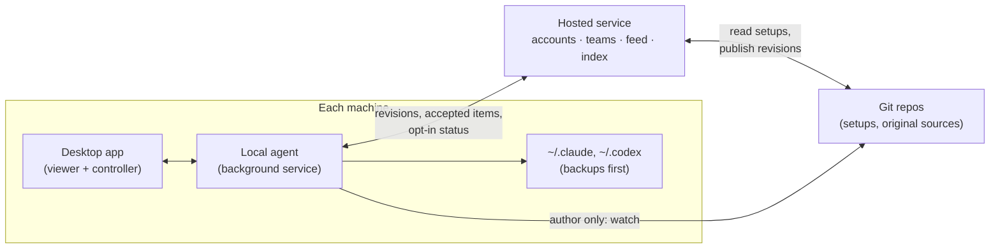
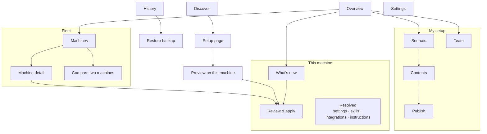
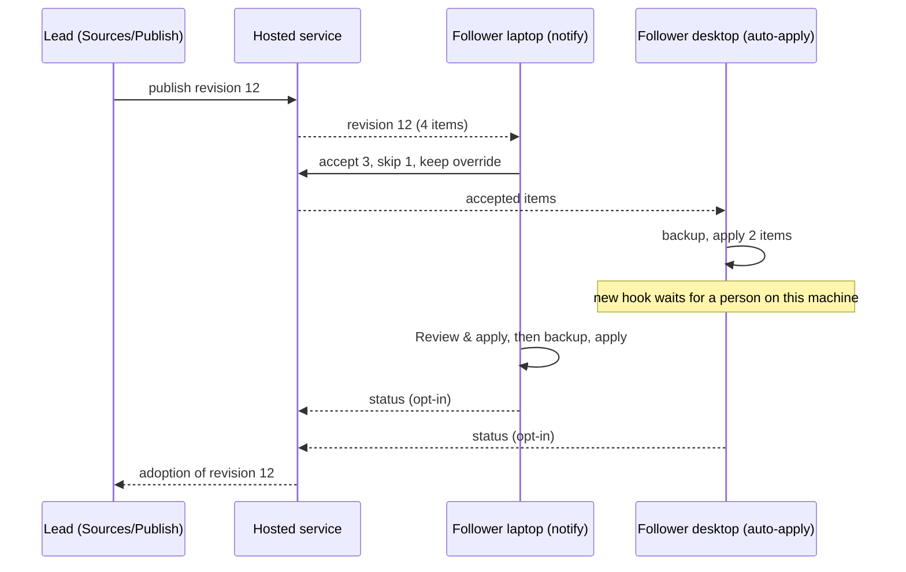

# Desktop app: UI map and feature map

Product vision for the nortuscc desktop app: the concepts it is built on, every screen and how
they connect, the main journeys, and the features grouped into phases. It is a north star, not a
build plan. Each phase still gets its own spec, plan and issue.

The visual language is direction **A · Console** from the UI prototype (#46, branch
`prototype/desktop-ui`, run with `npm run prototype` in `apps/desktop`). The resolution terms
(layers, pins, provenance) are the profile engine's (#41,
`docs/superpowers/specs/2026-10-05-profile-engine-design.md`).

## Intent

A developer runs coding agents (Claude Code, Codex) on several machines and wants each of
those machines set up the way they intend. Some developers also lead a team that should share
a curated setup. The app is foremost a **viewer**: it shows what each machine actually has, how
that compares with the setups it follows, and what is new. Changing a machine comes second, and
is always previewed, backed up and reversible.

It serves individuals first, with lightweight teams on top. There is no organisation admin,
and no machine is ever changed by someone else.

## Decisions

| Decision | Choice | Why |
| --- | --- | --- |
| Audience | Individuals, plus lightweight teams | A team is just people following one lead's setup. No roles or enforcement |
| Visibility | A member's machines are private. Each member may opt in to share a status summary with a team | The lead can see adoption without the app becoming monitoring |
| Upstream skill versions | **Pin only** | A follower receives exactly what the lead published. Only the author sees upstream skill updates, and nothing tracks upstream live |
| Partial adoption | Every update splits into items that are accepted or skipped one by one | The user asked for partial apply. This also keeps overrides safe |
| Fleet rollout | **Per-machine policy**: auto-apply, notify or manual | A user accepts an item once and their machines follow their own policies. A lead can never apply anything to someone else's machine |
| Infrastructure | A hosted service plus a local agent on every machine | The fleet adopts updates while the window is closed, and team status needs somewhere to go |
| Shell | Direction A · Console | Chosen from the prototype on 2026-10-05 |

## Concepts

- **Machine**: a computer with one or more agents. Its *actual state* is what is installed now.
- **Setup**: a published bundle containing instruction files (`CLAUDE.md`, `AGENTS.md`),
  owned settings keys, a skill list and integrations. Each skill entry names its original
  source and a pinned revision. Today's repository *is* a setup: `skills-manifest.txt`,
  `integrations.json`, `claude/settings.keys.json` and `skill-pins.json`.
- **Original source**: where a skill comes from. It is either a public repo
  (`mattpocock/skills`, the superpowers plugin) or the author's own (`Nortus222/agent-skills`,
  or a local folder managed by the skills CLI). Only the setup's author watches original
  sources.
- **Revision**: one published version of a setup, with a changelog. Followers only ever
  receive revisions.
- **Item**: the smallest unit of change. That is one setting key, one skill (with its
  version), one integration or one instruction file. Revisions, drift fixes and previews are
  all lists of items.
- **Layers**: desired values resolve from app default → followed setups, in the user's priority
  order → your setup → machine override. The nearest layer wins. Every value shows the layer
  that decided it. The engine today has base → pin → machine. Followed setups are a new layer,
  added in P4.
- **Override**: a value on one machine that wins over every setup. It is never overwritten
  silently. When a revision changes the same key, the result is a **conflict** that the user
  resolves.
- **Drift**: the actual state differs from the desired state, for example because something
  was installed by hand.
- **Apply policy**: set per machine: *auto-apply*, *notify* or *manual*. It decides what
  happens to items the user has accepted.
- **Team**: the people following one lead's setup. Members choose whether to share a status
  summary, which covers the revision applied, items adopted or skipped, and drift. It never
  includes file contents or values.

## Architecture

- **Local agent**: the engine plus the reconciler (#42), running in the background on each
  machine. It inspects the machine and detects drift, receives revisions and accepted items,
  and applies them according to the machine's policy. It takes a backup before every change
  and reports status when the user opts in. The window does not need to be open. It
  succeeds the fixture backend in `apps/desktop`.
- **Desktop app**: views and controls the local agent, and through it the hosted service. The
  renderer still never chooses paths or commands (the restriction from #39).
- **Hosted service**: accounts, teams and membership, the revision feed, which items each user
  has accepted (so their other machines follow), opt-in status summaries, and the Discover
  index. It stores references and metadata. Setups themselves stay in Git.
- **Git** remains the source of truth for setups and skills, and the CLI keeps working against
  it without the hosted service.

### Safety rules

- Every apply is preceded by a backup in `~/.claude/backups/`, and can be restored from History.
- **Auto-apply never applies items that run code or remove anything.** New or changed hooks, MCP
  servers, plugins and destructive changes always wait for a person on that machine, even when
  the machine's policy is auto-apply.
- A setup never contains secrets. It names environment variables and never their values.
  Publishing runs a secret scan and blocks on a finding.
- Status summaries contain no file contents, setting values or paths.

## Navigation

The Console shell from the prototype has a fixed left sidebar, a top bar with breadcrumbs, a ⌘K
palette, a current-machine chip and the primary action. Badges show counts that need attention.

Sidebar groups: **Overview** · *This machine*: What's new, Review & apply, Resolved · *Fleet*:
Machines · *My setup*: Contents, Sources, Publish, Team · *Community*: Discover · History ·
Settings. A user who has not authored a setup sees *My setup* collapsed into one "Create your
setup" entry.

## Screens

Every screen has a loading state, an offline state (where the local agent or the hosted
service is unreachable, showing the last known data with its age) and an error state that names
what failed. The table lists only states specific to each screen.

| Screen | Purpose | Shows | Primary actions | Specific states |
| --- | --- | --- | --- | --- |
| **Overview** | One look at everything that needs attention | KPI tiles (items waiting, conflicts, drift, revisions behind); this machine's health; a fleet table; What's new summary; Sources summary (author); activity | Review, Open What's new, Open Sources | All clear; first run |
| **What's new** | Decide on incoming revisions | Revisions from followed setups grouped by setup, each split into items with diffs, plus the changelog and the conflicts with overrides | Accept or skip each item, accept all, resolve a conflict (keep mine / take theirs) | Nothing new; conflict blocking; skipped items, which can be restored |
| **Review & apply** | Change this machine safely | The queue of accepted items plus drift fixes, the diff for each item, apply steps, and what the backup covers | Include or exclude, confirm destructive items, apply, cancel | Idle; running; completed; cancelled, showing the step where it stopped; failed, offering restore |
| **Resolved** | Explain this machine's configuration | Each setting, skill, integration and instruction file with its value, the layer chain (default → followed → mine → override) and the current on-disk value | Add or remove an override, open the deciding setup | Value differs from disk (drift); override shadowed by a newer revision |
| **Machines** | See the fleet | Each machine with its revision, drift, policy, agents and last-seen time | Open, compare, change policy, forget machine | Offline machine; machine on an old revision |
| **Machine detail** | One machine in depth | Health, pending items, overrides, apply history, policy | Change policy, request review on that machine | Policy waiting on code-running items |
| **Compare** | Why two machines differ | A side-by-side diff of resolved values and actual state | Copy an override across, if both machines are yours | Identical |
| **Contents** (author) | Edit your setup | Instruction files, owned settings, the skill list with its original source and pin, integrations | Edit, add a skill from Sources or Discover, change a pin | Unpublished changes |
| **Sources** (author) | Watch original sources | Each original source with new versions, `SKILL.md` diffs, release notes, and local edits not yet pushed | Bring a version into Contents, ignore a version | Up to date; source unreachable |
| **Publish** (author) | Release a revision | Changes since the last revision, a drafted changelog, the secret scan, required environment variables, and visibility (private, team, public) | Publish revision | Blocked by a secret finding |
| **Team** (author) | Lead a team | Members, invitations, and adoption per revision and item (opt-in members only) | Invite, remove member | No members; nobody sharing status |
| **Discover** | Find setups and skills | Search, collections by workflow, recently updated setups, and setups followed by people you follow | Open setup | No results |
| **Setup page** | Judge a setup | README, author, followers, changelog, an inventory, and trust signals (environment variables, code-running items, secret-scan result, last revision) | Preview on this machine, Follow, Copy, Take items | Already following; copied |
| **History** | Audit and recover | Applies, publishes, accepted and skipped decisions, backups | Restore a backup, open the matching diff | Restore running or completed |
| **Settings** | Configure the app | Account, connected repos, managed agents, default policy, telemetry, notifications | Sign in or out, connect repo | Signed out (local-only mode) |

### Adopting from Discover

- **Follow** adds the setup as a layer. Its revisions arrive in What's new.
- **Copy** forks it once into your setup. It receives no further updates.
- **Take items** copies chosen skills or settings into your setup. Each one remembers where it
  came from, so Sources can show that a newer version exists.

**Preview on this machine** shows the layer, items and conflicts that any of the three would
produce, and writes nothing.

## Journeys

1. **First run.** The app installs the local agent, detects the agents on this machine and
   inspects it. The user either imports the current configuration as *their setup* or follows
   an existing setup. The user sets this machine's policy (default: notify), and Overview shows
   the first diff.
2. **The lead updates their setup.** Sources shows superpowers 6.4.1 → 6.5.0 and three commits
   to `explain` in `Nortus222/agent-skills`. The lead reads both diffs and brings only
   superpowers into Contents. Publish drafts the changelog, the secret scan passes, and
   revision 12 goes to the team.
3. **A follower takes revision 12.** What's new shows four items. They accept three and skip
   one. One item conflicts with their `theme` override, and they keep theirs. Their laptop
   (policy: notify) shows Review & apply with a backup first. Their desktop (policy:
   auto-apply) applies the same three items in the background, except for a new hook, which
   waits for a person on that machine.
4. **The lead checks adoption.** Team shows revision 12 applied by 4 of the 6 members who
   share status, with one item skipped by most of them. That signals it should change in the
   next revision.
5. **Discover.** The user previews `mattpocock/ts-dev` on this machine, sees two conflicts and
   one MCP server that would run code, and takes only the `tdd` skill.
6. **Recovery.** After an apply breaks something, History shows the backup taken before it.
   Restore puts the files back, and the restore is itself recorded.

## Feature map

| Phase | Theme | Features | Screens | Issues |
| --- | --- | --- | --- | --- |
| P0 | Foundation | Profile engine: layers, pins per source, provenance | — | #41 (merged) |
| P1 | This machine | Real inspection, Resolved, Review & apply with backup and cancel, History and restore, the Console shell | Overview (this machine), Resolved, Review & apply, History, Settings (local) | #42 |
| P2 | Local agent and fleet | Background local agent, apply policies, the safety rule for code-running items, What's new from your own setup, conflicts, Machines, Compare | What's new, Machines, Machine detail, Compare | #43, plus a new issue for the local agent |
| P3 | Hosted service and authoring | Accounts, hosted feed, accepted-item sync across your machines, Sources watching, `SKILL.md` diffs, instruction files as items, Publish with secret scan | Contents, Sources, Publish, Settings (account) | New issues: hosted service, authoring |
| P4 | Teams | Follow a lead's setup (followed-setup layer in the engine), invitations, opt-in status summaries, adoption view | Team; What's new grouped by setup | New issue: teams |
| P5 | Discover | Hosted index, collections, setup pages with trust signals, Preview, Follow / Copy / Take items | Discover, Setup page | #44 |
| Parallel | Runtime | Smaller packaged backend runtime | — | #40 |

Each phase leaves a usable app. P1 manages one machine, P2 a personal fleet, P3 adds authoring,
P4 teams and P5 the public.

## Open questions

These are decided in the phase that needs them, not here.

- **Hosted stack and sign-in** (P3): GitHub OAuth is the natural fit, since setups live on
  GitHub. Hosting, storage and cost are still open.
- **Local agent packaging** (P2): a launchd/systemd/Windows service versus an app that keeps
  running in the menu bar, and how it relates to the CLI.
- **Several followed setups** (P4): the priority order is user-set, and conflicts between two
  followed setups appear in What's new. Whether to cap the number is open.
- **Private repos** (P3): which credentials the local agent uses to fetch a private setup,
  without the hosted service ever holding them.

## Out of scope

Organisation administration, roles and enforced settings. Remote apply onto anyone else's
machine. Live tracking of upstream skills by followers. Billing. Mobile clients.
