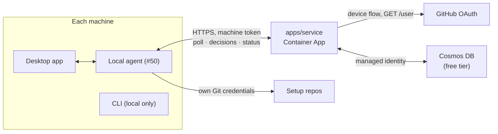

# Hosted service: accounts, revision feed and accepted-item sync

Issue #51, phase P3 of the UI and feature map
(`docs/superpowers/specs/2026-10-05-desktop-ui-feature-map-design.md`). It depends on the local
agent (#50) and machine sync (#43). Publishing (#52) and teams (#53) build on it. Engine terms
(layers, pins, provenance) are the profile engine's
(`docs/superpowers/specs/2026-10-05-profile-engine-design.md`).

## Intent and scope

A hosted service that connects one user's machines. It signs users in, registers their
machines, keeps a feed of their setups' revisions, and syncs which items the user accepted or
skipped, so accepting an item once is enough. It receives an opt-in status summary from each
machine. Setups stay in Git: the service stores references and metadata only, and never holds
credentials for private repos.

**Done when** accepting an item on one machine makes a second machine of the same user apply it
according to that machine's policy, through the service.

In scope: identity, machine credentials, the data model, the agent-facing API, privacy,
security, abuse limits, hosting and cost. Out of scope: teams, invitations and share flags
(#53); the Publish, Contents and Sources screens (#52); Discover (P5); push delivery; identity
providers other than GitHub. The data model reserves room for teams and public setups so those
phases add documents rather than migrate them.

Unchanged by this work: local-only mode works without an account, and the CLI stays
zero-dependency and works without the service.

## Decisions

| Decision | Choice | Why |
| --- | --- | --- |
| Hosting | Azure Container Apps (consumption) and Azure Cosmos DB for NoSQL (free tier) | Scales to zero, and the Cosmos free tier covers the expected load at no cost |
| Delivery | Agents poll with conditional requests | On Azure, push requires Web PubSub, whose free tier allows about 20 connections. A poll every 15 minutes is enough to apply updates while the app window is closed |
| Sign-in | GitHub OAuth device flow, run by the service, with no scopes | One flow for the app, headless machines and later the CLI. The service never keeps a GitHub token |
| Revisions | Registered by the author's machine, never read from Git by the service | Public and private repos work the same way, and the service never needs repo credentials |
| Decision scope | Account-wide | Accept once and every machine follows under its own policy. A machine that should differ uses a local machine override |
| Own-fleet status | Reported by default, visible only to the owner, and can be turned off per machine | The Machines screen works from first sign-in. Sharing with a team is a separate opt-in (#53) |
| Sign-up | GitHub logins on a server-side allowlist; a configuration switch opens sign-up later | Keeps abuse and cost exposure negligible until Discover needs the public |
| Code location | `apps/service` and `packages/hosted-protocol` in this repo | One PR can change the protocol, the service and the agent together |

## Architecture



- **`packages/hosted-protocol`**: Effect Schemas for every request and response body, and the
  error codes. The service and the local agent both import it. It is TypeScript restricted to
  erasable syntax and has no build step, the same setup as `packages/profile-engine`.
- **`apps/service`**: a Node 24 HTTP server in TypeScript with the repository's pinned
  `effect`, a workspace in the root lockfile like every other package. Two Effect services
  form its boundaries:
  - `Store`, with an in-memory implementation for tests and a Cosmos implementation for
    production;
  - `GitHub` (device-code request, token exchange, `GET /user`), with a fake for tests.

  The service does not import the profile engine. It never resolves configuration.
- **`apps/service/infra`**: Bicep templates for:
  - one Container Apps environment (consumption only, no dedicated workload profiles);
  - one Container App: 0.25 vCPU, 0.5 GiB, minimum 0 replicas, maximum 2, HTTPS-only
    ingress;
  - one Cosmos DB account with the free tier enabled and key access disabled
    (`disableLocalAuth`), holding one database at a fixed (manual) 1000 RU/s shared by its
    containers;
  - a user-assigned managed identity with the Cosmos data-contributor role;
  - a Log Analytics workspace with 30-day retention;
  - budget alerts.

  It is deployed to one region, chosen at deploy time.
- **Image and deploy**: GitHub Actions builds the image, publishes it to GHCR (the repository is
  public) and deploys with Azure OIDC federation. No Azure secret is stored in GitHub.
- **Secrets**: the service holds none. Device flow needs only the OAuth app's public client id,
  and Cosmos is reached through the managed identity. Configuration is the client id, the
  allowlist, the Cosmos endpoint and the open-sign-up switch.

**Who talks to the service.** Only the local agent holds a machine credential and calls the
service. The desktop app reaches the service through the agent, and the renderer never sees the
token. The CLI does not call the service in this phase.

## Identity and credentials

### Sign-in

The service runs GitHub's OAuth device flow for an OAuth app with device flow enabled and no
scopes requested.

1. The agent calls `POST /v1/auth/device/start` with a machine description:
   - a display name the user chooses (the default is `<OS> machine`; the hostname is never sent
     unless the user types it);
   - the OS family (`macos`, `linux`, `windows`);
   - agent kinds (`claude`, `codex`).

   The service requests a device code from GitHub, stores a pending session, and returns
   `{ pendingId, userCode, verificationUri, interval, expiresIn }`.
2. The user enters the code on github.com from any browser.
3. The agent calls `POST /v1/auth/device/poll { pendingId }` at the given interval. The service
   exchanges the device code. On success it calls `GET /user` once, keeps the numeric GitHub id
   and login, and discards the GitHub token without storing it.
4. If the GitHub id is not on the allowlist and sign-up is closed, the response is
   `403 not_allowlisted`. Otherwise the service creates the account if it is new, creates the
   machine, and returns `{ accountId, login, machineId, token }`.

The service performs the exchange itself, instead of accepting a GitHub token from the client,
for two reasons. Only tokens issued to this OAuth app can establish a session, so a token
obtained by some other app can't be replayed here. And the allowlist is enforced in one place.

Device-flow responses map to the API as follows: `authorization_pending` and `slow_down` return
`202` with the next interval; `expired_token` and `access_denied` return `410 sign_in_expired`.

### Machine credential

- Each machine gets one opaque bearer token: `nmt_<accountId>_<machineId>_<secret>`, where the
  secret is 256 random bits, base64url-encoded.
- The service stores only the SHA-256 hash of the secret on the machine document. It finds the
  document by the embedded ids (a single point read) and compares hashes in constant time.
- Tokens do not expire. A token is revoked when its machine is forgotten (from any of the
  owner's machines), when that machine signs out, or when the account is deleted. Revocation
  deletes the hash, so the next request returns `401 unauthenticated`.
- The agent stores the token in the OS keychain (macOS Keychain, libsecret, Windows Credential
  Manager). Where none is available, it falls back to a file readable only by the user (mode
  `0600`). How the agent does this is #50's concern; this spec only requires it.
- The `nmt_` prefix makes tokens recognisable, so #52's publish-time secret scan can block one
  from being published inside a setup.

## Data model

Cosmos DB for NoSQL, one database, three containers. Every document carries `type` and a
schema `version`.

| Container | Partition key | Documents |
| --- | --- | --- |
| `accounts` | `/accountId` | `account`, `machine`, `decision`, `status` |
| `setups` | `/setupId` | `setup`, `revision` |
| `identities` | `/id` | `identity` (`github:<id>` → account id), `deviceSession` (expires after 15 minutes) |

Partitioning by account keeps an account's reads to point reads, puts related writes in one
transactional batch, and makes deletion a single-partition sweep.

### `accounts` container

- **account**: `accountId` (random ULID), `githubId`, `login`, `seq` (a counter bumped by every
  change other machines must see), `defaultPolicy` (`notify`; the policy a newly registered
  machine starts with), `createdAt`.
- **machine**: `machineId`, `name`, `os`, `agents`, `policy` (`auto-apply` | `notify` |
  `manual`), `reportStatus` (default `true`), `tokenHash`, `createdAt`, `lastSeenAt`.
  `lastSeenAt` is written at most once every 5 minutes so polling stays cheap.
- **decision**: one per (setup, item), with id `decision:<setupId>:<itemId>`:
  `{ setupId, itemId, revision, decision: 'accept' | 'skip', decidedAt, machineId, seq }`.
- **status**: one per machine, replaced on every report (see Status summary).

### `setups` container

- **setup**: `setupId`, `ownerAccountId`, `name`, `repoUrl` (fixed when the setup is created),
  `visibility` (only `private` in this phase; `team` and `public` are reserved for #53 and P5),
  `latestRevision`, `createdAt`.
- **revision**: `number`, `commitSha`, `tag`, `changelog` (Markdown, at most 16 KB),
  `items`, `requiredEnv` (variable names only), `publishedAt`, `machineId`.

### Items

An item in a revision is `{ id, kind, change }`:

- `kind`: `setting`, `skill`, `integration` or `file`;
- `change`: `added`, `changed` or `removed`.

Ids are logical engine ids, never machine paths:

- `setting:claude:settings.json#effortLevel`
- `skill:Nortus222/agent-skills/explain`
- `integration:superpowers-codex`
- `file:claude:CLAUDE.md`

Ids must match `^(setting|skill|integration|file):[A-Za-z0-9._:/#@-]{1,200}$`. Only setup
contents are items. Keys that exist only in a machine's plan, such as skill links or undeclared
entries, never appear in a revision or a status summary.

Items carry no values and no digests. A hash of a low-entropy value such as `"medium"`
reveals the value, so a digest would break the rule that the service never holds values.
Integrity comes from Git instead. The agent fetches the revision's tag from the setup's
`repoUrl` with its own credentials and requires it to resolve to the recorded `commitSha`.
Checking the tag, not just the SHA, matters: GitHub serves a fork's commits from the parent
repository by SHA, so a SHA alone does not prove the commit belongs to the setup. The agent
then recomputes the items from the engine and refuses to apply anything from a revision whose
items differ from the record (`RevisionMismatch`, shown in What's new). The service cannot
check that a tag or commit exists, so a missing one surfaces on the agent as
`RevisionUnavailable`.

### Decision rules

- A decision names the revision whose change it decides.
  - If a later revision changes the same item again, the item becomes undecided for that
    revision.
  - If a later revision leaves the item unchanged, the earlier decision stands.
  - The agent computes the effective state; the service stores decisions as sent.
- Skipping is reversible: a later `accept` replaces a `skip`, and the reverse also holds.
- A decision for a revision older than the stored decision's revision is not stored. Each
  decision in a request is judged on its own, so one stale decision never rejects the others:
  the response lists each decision's outcome, `stored` or `stale`, and the agent re-syncs to
  learn the newer decision.
- Otherwise the decision that reaches the service last wins. Two machines deciding offline
  resolve in arrival order, and both decisions appear in History on the machines that made
  them.
- Every write that other machines must see increments the account's `seq` in the same
  transactional batch. That covers decisions, machine settings changes, forgotten machines and
  revisions of owned setups. A Cosmos transactional batch holds at most 100 operations, so a
  request's decisions are written in chunks of up to 99 plus the account document. Each chunk
  is atomic; a failure part-way reports the remaining decisions as unprocessed, and the agent
  resends them. Concurrent writers retry when the account document's ETag has changed.

## API

Version 1, JSON over HTTPS, base path `/v1`. Every endpoint except sign-in and `GET /v1/health`
requires `Authorization: Bearer nmt_…`. Request and response bodies are the
`hosted-protocol` schemas, and the service rejects any field it does not know.

| Method and path | Purpose |
| --- | --- |
| `POST /v1/auth/device/start`, `POST /v1/auth/device/poll` | Sign in and register this machine (see Sign-in) |
| `POST /v1/auth/sign-out` | Revoke this machine's token and delete its status |
| `GET /v1/sync?since=<seq>` | The polling call (below) |
| `PUT /v1/decisions` | Upsert 1 to 500 decisions, each `{ setupId, itemId, revision, decision }`. Returns `{ seq, results: [{ setupId, itemId, outcome: 'stored' \| 'stale' \| 'unprocessed' }] }`. Every item must exist in the named revision of a setup the account owns, otherwise the whole request is `invalid` |
| `POST /v1/setups`, `GET /v1/setups` | Register a setup (`name`, `repoUrl`), list the account's setups |
| `POST /v1/setups/:id/revisions` | Owner only. `number` must equal `latestRevision + 1`, otherwise `409 revision_conflict`. This is the endpoint #52's Publish calls |
| `GET /v1/setups/:id/revisions?after=<n>` | Revision records after `n`, oldest first, at most 50 per page |
| `GET /v1/machines` | The account's machines with their latest status summaries |
| `PATCH /v1/machines/:id` | Change `name`, `policy` or `reportStatus` of one of the account's machines |
| `DELETE /v1/machines/:id` | Forget a machine: revoke its token, delete its status |
| `PUT /v1/machines/self/status` | Replace this machine's status summary. Returns `409 status_disabled` when `reportStatus` is off |
| `GET /v1/account/export` | Every stored document for the account, as JSON |
| `DELETE /v1/account` | Hard-delete the account (see Privacy) |
| `GET /v1/health` | Liveness for deploy smoke tests. Touches no data |

### Sync

`GET /v1/sync?since=<seq>&setups=<setupId>:<latestKnownRevision>,…` returns:

```json
{
  "seq": 42,
  "decisions": [{ "setupId": "…", "itemId": "…", "revision": 12, "decision": "accept", "decidedAt": "…", "machineId": "…" }],
  "revisions": [{ "setupId": "…", "number": 12, "commitSha": "…", "tag": "…", "changelog": "…", "items": [], "requiredEnv": [] }],
  "machine": { "policy": "auto-apply", "reportStatus": true },
  "setups": [{ "setupId": "…", "name": "…", "repoUrl": "…", "latestRevision": 12 }],
  "pollAfter": 900
}
```

- **Contents:** decisions written after `since`; revisions newer than the client's for every
  setup the account owns; this machine's settings; and the account's setups, so a new one can
  be offered.
- **Conditional requests:** the response carries an ETag derived from `seq` and the `setups`
  parameter, so a client that already holds every revision gets the same ETag. A request with
  a matching `If-None-Match` returns `304` after one point read of the account document.
- **Cadence:** the agent polls every `pollAfter` seconds (default 900) with ±20% jitter. It also
  polls immediately after making a local decision and whenever the desktop app gains focus.
  `pollAfter` lets the service slow polling without an agent release.

### Offline behaviour

The service is never on the apply path. When it is unreachable:

- the agent keeps the last synced state and keeps applying already-decided items according to
  its policy;
- decisions and machine settings changes (policy, name, `reportStatus`) made locally go into
  one outbox and are sent in order when the service returns. As with decisions, the change
  that reaches the service last wins, and the next sync tells every machine the result;
- the app shows the age of the synced data, as the feature map's offline state requires.

Signing out returns the machine to local-only mode with its local data intact.

### Errors

Errors are `{ "error": "<code>", "message": "<text>" }` with these codes:

| Code | Status |
| --- | --- |
| `unauthenticated` | 401 |
| `not_allowlisted` | 403 |
| `forbidden` | 403 |
| `not_found` | 404 |
| `invalid` | 400 |
| `payload_too_large` | 413 |
| `revision_conflict` | 409 |
| `status_disabled` | 409 |
| `limit_reached` | 409 |
| `sign_in_expired` | 410 |
| `rate_limited` | 429, with `Retry-After` |
| `unavailable` | 503, with `Retry-After`, when Cosmos throttles |

Another account's resources return `not_found`, never `forbidden`, so ids cannot be probed.

## Status summary

Machines report by default, and the summary is visible only to the account's own machines.
Turning `reportStatus` off on a machine deletes its stored summary, but decision sync keeps
working. Sharing with a team is a separate opt-in that #53 adds with its own share documents;
it never widens what one summary contains.

```json
{
  "reportedAt": "…",
  "policy": "notify",
  "agents": ["claude", "codex"],
  "setups": [{
    "setupId": "…",
    "revisionApplied": 12,
    "adopted": ["skill:…"],
    "skipped": ["setting:…"],
    "pending": ["setting:…"],
    "waitingForPerson": ["integration:…"]
  }],
  "drift": { "setting": 1, "skill": 2, "integration": 0, "file": 0 }
}
```

- Accepted items that are not applied yet fall in one of two lists. `pending` items will be
  applied without a person: the machine is on auto-apply and the item is inert. Items in
  `waitingForPerson` need a person on that machine, whether because of the machine's policy
  (notify or manual) or the safety rule for code-running and removing items. An agent's finer
  local states map onto these two.
- Drift is reported as **counts only**. Naming drifted entries would reveal skills or settings
  installed by hand, which are not part of any setup.
- Every item id must belong to a known revision of the named setup, or the request is rejected
  as `invalid`. This stops a client bug from uploading arbitrary strings such as paths.
- The summary contains no file contents, setting values, paths or environment variable values.

## Safety

The feature map's safety rules hold unchanged. The service adds these:

- **The service changes which items are accepted, never which setups a machine trusts.** The
  set of setups a machine applies is stored locally on that machine. A setup that appears
  through sync is offered as a prompt and is never applied until a person on that machine
  adds it. This happens once per machine and setup, including for the user's own setup: after
  sign-in, the agent offers the account's setups, and the done-when scenario's second machine
  trusts the setup this way before anything syncs to it.
- **The agent decides what runs code.** It classifies items from the fetched commit, never from
  service data, so auto-apply still holds back new or changed hooks, MCP servers, plugins and
  removals until a person on that machine approves them.
- **The service never chooses content.** It names a tag and a commit; the agent fetches the
  tag from the setup's fixed `repoUrl`, requires it to resolve to that commit, and checks the
  items against the record before applying anything.
- **Remote policy changes stay within one account.** `PATCH /v1/machines/:id` lets a user set
  the policy of their own machines from another of their machines. No API acts on another
  account's machine.

## Privacy

**Stored:**
- GitHub numeric id and login;
- machine name, OS family, agent kinds, policy, `reportStatus` and timestamps;
- setup names and repo URLs;
- revision records;
- decisions;
- the latest status summary for each machine.

**Never stored:**
- file contents, setting values or paths;
- environment variable values or hostnames (unless the user types one as a machine name);
- GitHub tokens or plaintext machine tokens;
- IP addresses (the per-IP rate limiter keeps them in memory only).

**Logs** record the request id, route template (never the concrete path), status code, latency
and a SHA-256 of the account id. They never record bodies, query strings or tokens. Log
Analytics keeps them for 30 days.

**Retention:**
- Status summaries are replaced, not accumulated.
- Decisions and revisions last as long as the account.
- Deleting an account removes every document in its partition, its identity document and its
  setups and their revisions, then returns `204`. The data leaves Cosmos's periodic backups
  when their retention window ends (8 hours by default).
- `GET /v1/account/export` returns everything the service holds about the account.

## Security

- **Transport:** HTTPS only, through Container Apps ingress with a managed certificate.
- **Authorisation:** every query takes `accountId` from the verified token, never from the
  request. Setup writes check `ownerAccountId`.
- **No admin API.** Operator access is through Azure only.
- **No service secrets.** Cosmos uses the managed identity with key access disabled, and
  deploys use OIDC federation.
- **Device flow:** sessions expire after 15 minutes and can be redeemed once.
- **Stolen machine token:** the attacker can read the account's metadata, post decisions and
  register revisions of commits in repos the account already registered. The attacker cannot
  make any machine trust a new setup, apply anything that runs code without a person, or reach
  another account. The fix is to forget the machine from any other machine.
- **Dependencies:** pinned exactly, with committed lockfiles. CI scans the image for known
  vulnerabilities.

## Abuse limits

The allowlist is the main control in this phase. These limits keep the service safe once
sign-up opens:

| Limit | Value |
| --- | --- |
| Machines per account | 25 |
| Setups per account | 10 |
| Items per revision | 500 |
| Revision record size | 64 KB |
| Revisions per setup per day | 100 |
| Decisions per request | 500 |
| Request body | 128 KB |
| Requests per machine token | 60 per minute |
| Device-flow starts per IP | 10 per hour |

- Exceeding a count returns `409 limit_reached`; exceeding a rate returns `429`.
- Rate limits are token buckets held in memory on each replica. With at most two replicas they
  are approximate, which is acceptable at this scale.
- The fixed 1000 RU/s throughput caps database load: Cosmos throttles instead of billing, and
  the service returns `503` with `Retry-After`.

## Cost

Prices are Azure retail for West Europe, checked on 2026-10-05.

| Resource | Free allowance | Beyond it | Expected |
| --- | --- | --- | --- |
| Container Apps (consumption) | 180,000 vCPU-s, 360,000 GiB-s and 2M requests per subscription per month | $0.000034 per vCPU-s, $0.000004 per GiB-s, $0.56 per million requests | $0 when idle. About $20 a month if one replica stays up all month, which a few machines polling can cause |
| Cosmos DB | Free tier: 1000 RU/s and 25 GB, one account per subscription | Fixed throughput, so load is throttled rather than billed | $0 |
| GHCR | Free for public repositories | — | $0 |
| Log Analytics | First 5 GB per month | Per GB | $0 |

- Polling every 15 minutes stays inside the free request grant up to about 700 machines.
- The default `*.azurecontainerapps.io` hostname avoids paying for a domain; a custom domain is
  optional.
- Budget alerts on the resource group fire at $10 and $25.
- If compute ever exceeds the free grant, the service can write a per-account change marker to
  Blob Storage. Agents would poll that marker with conditional requests and call the app only
  when it changes. This is recorded as an option, not built now.

## Testing

Tests are written first and use `node:test` with `node:assert/strict`.

- **Protocol**: every schema decodes valid examples, rejects unknown fields and out-of-range
  values, and round-trips.
- **Service handlers**, against the in-memory `Store` and a fake `GitHub`:
  - sign-in: every device-flow outcome, the allowlist, and the GitHub token never being stored;
  - token checks and revocation;
  - one account never reading or writing another's data (`not_found`);
  - every limit;
  - per-decision outcomes, including a stale decision beside stored ones, chunking past 99
    decisions, and revision numbering conflicts;
  - `seq` ordering under concurrent writers;
  - ETag and `304` responses;
  - status validation and `status_disabled`;
  - export, and deletion leaving no documents behind;
  - logs containing no bodies, tokens or concrete paths.
- **Store contract**: one suite run against both the in-memory store and the Cosmos emulator,
  so the two cannot diverge. CI runs the emulator job.
- **Deploy smoke**: `GET /v1/health`, and an unauthenticated `GET /v1/sync` returning `401`.
- **End to end**: the done-when scenario. It uses two local agent instances (#50) with
  temporary homes and a local service, and covers:
  - a revision is registered through `POST /v1/setups/:id/revisions` by a test helper, since
    #52's Publish is its eventual caller;
  - machine B trusts the setup once, as a person would after sign-in;
  - an item is accepted on machine A;
  - machine B (auto-apply) applies that item and holds back a hook item for a person;
  - machine C (notify) queues both;
  - all three record the result in History.

  It runs once #50 exists.

Done when the protocol and service tests pass, the store contract passes against the emulator,
the end-to-end scenario passes, the infrastructure deploys from CI, and the root `npm test`
still passes.

## Later

- Push delivery through Azure Web PubSub, or the Blob change marker above, if polling latency
  or cost becomes a problem.
- Team share documents and the adoption view (#53). Followed setups' revisions do not bump a
  follower's `seq`, so #53 extends the sync ETag with the latest revision of each followed
  setup.
- Public setups and the Discover index (P5).
- "Request review on that machine" from the Machine detail screen. It needs a notification to
  one machine, which this API does not carry yet.
- Additional identity providers.
