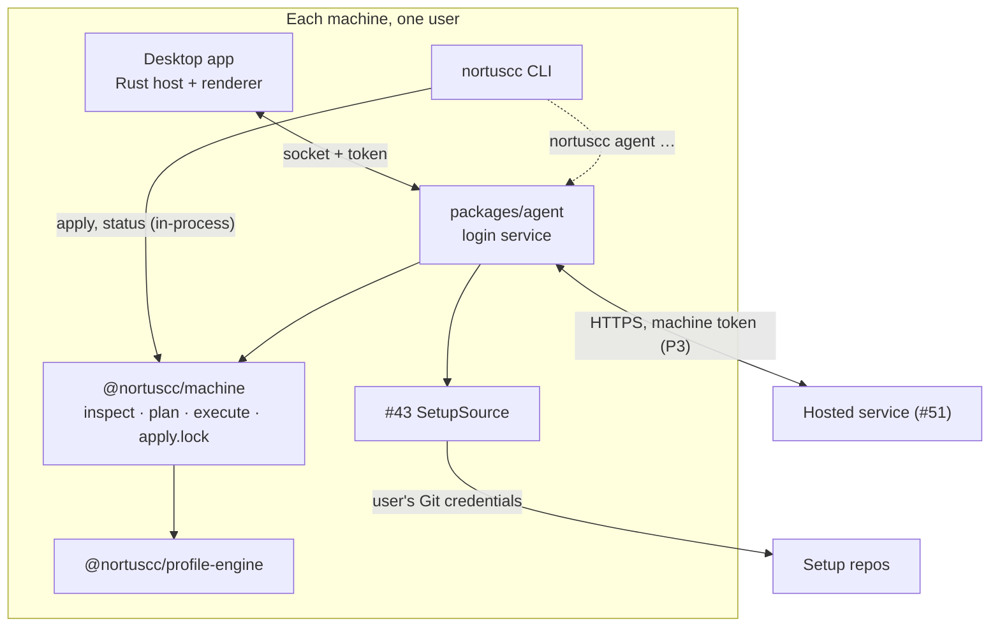

# Local agent: a background service that keeps each machine on its policy

Issue #50, phase P2 of the UI and feature map
(`docs/superpowers/specs/2026-10-05-desktop-ui-feature-map-design.md`). It runs on
`@nortuscc/machine` (#42, `docs/superpowers/specs/2026-10-05-machine-rebuild-design.md`) and
pairs with machine sync (#43). The hosted service (#51,
`docs/superpowers/specs/2026-10-05-hosted-service-design.md`) depends on it, and the agent is
that service's only client. Engine terms (layers, pins, provenance) are the profile engine's
(`docs/superpowers/specs/2026-10-05-profile-engine-design.md`).

## Intent and scope

A process on every machine that keeps the machine on its policy while the app window is closed.
It inspects the machine on a schedule and reports drift. It applies accepted items according to
the machine's apply policy (*auto-apply*, *notify* or *manual*). It backs up before every apply
and records the apply in History. The desktop app becomes its client, and so does the CLI for
the agent's own commands.

**Done when**, with the window closed, an accepted item is applied on an auto-apply machine, a
hook item waits for a person on that machine, and both show up in History.

In scope:

- packaging and installation;
- how the agent relates to the CLI and to the app;
- the local IPC and how it is secured;
- scheduling;
- the policy engine and the code-running safety rule;
- notifications;
- History;
- upgrading the agent itself;
- failure and recovery;
- the agent's side of the hosted service.

Out of scope:

- implementing machine sync. #43 owns fetching, verifying and applied revisions, and this spec
  only names the interface the agent needs from it;
- the hosted service itself (#51);
- a tray or menu-bar icon;
- followed setups (P4).

Unchanged: the CLI works without the agent and without the hosted service, local-only mode
works without an account, and the renderer never chooses a path or a command (#39).

## Decisions

| Decision | Choice | Why |
| --- | --- | --- |
| Packaging | A per-user login service: a LaunchAgent on macOS, a `systemd --user` unit on Linux, a per-user logon Scheduled Task on Windows | It runs as the user, so it reaches the user's homes and keychain. It survives the app quitting and runs on headless machines. A system service would run as another user |
| Code and runtime | A new `packages/agent` replaces the app's Bun sidecar. The app ships it with its bundled Bun and registers it. App-less machines run it from the checkout on Node 24 | The agent is the backend moved out of the window. Protocol v2's requests (#58) carry over, so that work moves instead of being rewritten |
| CLI | Stays standalone and in-process, sharing `apply.lock`. It talks to the agent only for `nortuscc agent …` | The CLI must keep working on machines with no agent |
| IPC | A user-only Unix socket or named pipe, plus a per-start token file checked in `hello` | Same-user only, with a second check where pipe permissions are weak. No TCP port for browsers to reach |
| Scheduling | Timer plus events, without file watching | Agents rewrite `~/.claude` constantly. Watching would mostly report the agents' own writes |
| Safety rule | A fail-closed classifier: auto-apply only items it proves inert. Every skill waits for a person for now | Code can arrive through settings keys, copied config files and skills, not only through integrations |
| Drift | Never auto-applied | A hand edit may be deliberate |
| Notifications | Posted by the app under its own identity. The agent draws no UI | A headless process has no notification identity on macOS or Windows |
| History | Append-only JSON Lines, shared by the agent and the CLI | Small, append-only data that works the same on Node and Bun with no native dependency |
| Upgrades | Whoever installed the agent upgrades it. The agent never downloads code | No network path runs code, which matches the safety model everywhere else |
| Recovery | A failed or interrupted auto-apply pauses auto-apply until a person resumes it | No retry loops, and a crash loop cannot keep changing the machine |

## Architecture



`packages/agent` is a library with one entry point, `runAgent(paths)`. It holds:

- **Scheduler**: triggers and the single job queue.
- **Job**: refresh, resolve, inspect, sort, classify and act (see Run loop).
- **Classifier**: the pure safety rule.
- **IpcServer**: the socket, the handshake and the request handlers.
- **Notifier**: delivery and deduplication.
- **HostedClient** (P3): sync, outbox and status reports.
- **Service units**: rendering and registering the login service for each OS.

`MachinePaths` comes from `pathsFromEnvironment`, exactly as the CLI and the app build it. The
agent reads no environment below that.

### The app

- The Bun sidecar goes away. The Rust host connects to the agent's socket instead of spawning a
  backend, so the window adds no process. Protocol v2's commands from #58 (`inspect`,
  `preview { exclude }`, `apply { planId }`, `cancel` and `shutdown`) move into the agent
  unchanged. So do their results, including the re-plan check's
  `{ status: 'stale', planId, plan }`, and their error codes, such as `PROFILE_INVALID`.
- The app bundles the agent: Bun plus the agent bundle, as resources. It registers the login
  service on first run (journey 1 in the feature map).
- Rust keeps its allow-list of request names. The renderer sends only opaque item keys taken
  from a report, and the agent checks them against that report.

### The CLI

- `apply`, `status`, `uninstall` and the rest stay in-process on `@nortuscc/machine`. They
  share `<stateRoot>/apply.lock` with the agent, so the two never change a machine at once.
- New commands reach the agent through the socket:

  | Command | Does |
  | --- | --- |
  | `nortuscc agent install [--linger]` | Registers the login service to run from this checkout. Refuses when the app has registered it |
  | `nortuscc agent uninstall` | Drains the agent and removes the service registration |
  | `nortuscc agent run` | Runs the agent in the foreground. The service unit calls this on app-less machines |
  | `nortuscc agent status` | Policy, paused state, pending, held and drift counts, last inspection, last sync |
  | `nortuscc agent review` | On a TTY only: preview pending and held items, confirm, apply. This is how a person approves held items on a headless machine |
  | `nortuscc agent resume` | Clears a pause after a failure |
  | `nortuscc agent policy <auto-apply\|notify\|manual>` | Sets this machine's policy |

- On any interactive command, the CLI asks a reachable agent for `status`. When items wait for
  a person, it prints one line to stderr: `2 items wait for you: run nortuscc agent review`.

### Revisions

What's new, pending items and decisions are all relative to a **revision**, which takes two
forms:

- **P2, local-only.** No revision records exist yet: #52's Publish creates them. A revision is
  a commit on the tracked branch of the setup's remote, normally `origin/main` of
  `MachinePaths.repo`, as #43 fetches it from the trusted `repoUrl`. Its items are the
  engine's diff between the applied commit's `DesiredConfig` and this commit's. It has no
  number and no tag. Decisions name it by commit SHA and stay on this machine.
- **P3, a setup linked to the hosted service.** A revision is a hosted record
  `{ number, commitSha, tag, items, … }`. Decisions name it by number and sync across the
  user's machines.

A setup switches from commits to records when a person links it to a hosted setup (see Trusted
setups). Decisions made before the link keep their commit SHAs and are never uploaded.

### Contract with machine sync (#43)

The agent needs three operations, and #43 implements them as a `SetupSource` service:

- `fetch()` updates the setup's remote refs from its trusted `repoUrl` with the user's own Git
  credentials, and never touches the user's working tree. The author's checkout is their
  working copy.
- `load(revision)` returns the `DesiredConfig` at a revision, verified:
  - **a record (P3):** fetch the record's **tag** from `repoUrl`, and require it to resolve to
    the record's `commitSha`. A SHA alone proves nothing, because GitHub serves a fork's
    commits by SHA from the parent repository. Without this check, someone holding a stolen
    machine token could register a fork commit as a revision, accept its inert items and set
    a machine to auto-apply. `load` then recomputes the items from the engine and compares
    them with the record;
  - **a commit (P2):** require the commit to be reachable from the tracked remote branch
    fetched from `repoUrl`.

  It fails with `RevisionMismatch` when the tag points elsewhere or the recomputed items differ
  from the record, and with `RevisionUnavailable` when the tag or commit cannot be fetched.
- `effective(decisions)` returns this machine's desired configuration: the applied revision,
  plus the accepted items from newer revisions. Skipped and undecided items stay at their
  applied value. Conflicts with overrides come back as a list and are never resolved silently.

#43 also owns recording which revision is applied and resolving conflicts. The agent only
surfaces conflicts in its status. Until #43 lands, the agent's tests fake `SetupSource`.

### Agent state

Everything lives under `<stateRoot>` (`~/.config/nortuscc` by default):

| Path | Holds |
| --- | --- |
| `agent/` (mode 0700) | Everything below except History and decisions |
| `agent/agent.sock`, `agent/agent.token` | The IPC endpoint and its token (see IPC) |
| `agent/agent.json` | `{ version: 1, policy, policySource: 'default' \| 'person', paused, installedBy: 'app' \| 'cli', agentVersion }` |
| `agent/setups.json` | The setups this machine trusts (see Trusted setups) |
| `agent/outbox.json` (P3) | Changes waiting to reach the hosted service, in order (see Hosted service) |
| `agent/sync.json` (P3) | `{ version: 1, seq, etag, lastSyncAt, latestRevision: { [setupId]: number } }` |
| `agent/revisions/<setupId>.json` (P3) | The synced revision records of each setup, used for What's new and verification |
| `agent/machine-token` (P3) | The machine token, only when no OS keychain is available. Mode 0600 |
| `agent/notified.json` | Hashes of item sets already notified |
| `agent/agent.log` | The service's stdout and stderr, rotated at 1 MiB, keeping 3 files |
| `decisions.json` | Accept and skip decisions (see Decisions) |
| `history/<YYYY-MM>.jsonl` | History (see History) |

### Decisions

Decisions sit beside `overrides.json`, outside `agent/`, because they are user intent like
overrides. The file holds the current decision for each setup and item:

```json
{
  "version": 1,
  "decisions": [{
    "setupId": "01J…",
    "itemId": "setting:claude:settings.json#effortLevel",
    "revision": 12,
    "commit": null,
    "decision": "accept",
    "decidedAt": "2026-10-05T12:00:00Z",
    "machineId": "01J…",
    "source": "local"
  }]
}
```

- `setupId` is the hosted id, or `local` for a setup not linked to the hosted service.
- Exactly one of `revision` (a record's number, P3) and `commit` (a SHA, P2) is set.
- `machineId` is the deciding machine, or `null` before sign-in.
- `source` is `local` when a person decided on this machine, and `synced` when the decision
  arrived from another machine.
- A newer decision for the same setup and item replaces the older one. Only the current
  decision is kept, and History keeps the past.

A `DecisionsStore` service reads and writes the file with an atomic replace. Recording a local
decision for a revision record also appends it to the outbox. While the agent is reachable,
every writer routes decisions through it. The CLI writes the file and the outbox directly only
when no agent answers.

### Trusted setups

`agent/setups.json` lists the setups this machine applies:

```json
{
  "version": 1,
  "setups": [{ "setupId": null, "repoUrl": "github.com/nortus222/claude-config", "checkout": "/Users/…/claude-config", "trustedAt": "…" }]
}
```

- **The user's own setup (P2).** Installing the agent is a person on this machine acting, so it
  adds the own repo as `setupId: null`, with `checkout: MachinePaths.repo` and `repoUrl` set to
  that checkout's `origin` URL.
- **Normalized URLs.** A `repoUrl` is normalized before it is stored or compared: lower-case
  host and owner, no scheme, no credentials, no `.git` suffix, and the SSH form rewritten
  (`git@github.com:Owner/Repo.git` → `github.com/owner/repo`).
- **Linking or trusting (P3).** After sign-in, sync lists the account's setups. A setup whose
  normalized `repoUrl` equals an entry with `setupId: null` is offered as a link ("this
  checkout is your setup *name*"). Any other setup is offered for trust, showing its `repoUrl`.
  A person accepts either offer with `trustSetup { setupId }`:
  - a link sets the entry's `setupId`;
  - a trust adds `{ setupId, repoUrl, checkout: null }`, and #43 fetches it into its own clone
    under `<stateRoot>`.

  This happens once per machine and setup. The done-when scenario's second machine does it for
  the user's own setup after sign-in.
- **Only a person changes trust.** A setup that appears through sync is offered and is never
  trusted automatically. Removing a setup's entry is likewise a person's action.

## Run loop

### Triggers

Triggers that arrive while a job runs coalesce into one follow-up job. Jobs never overlap.

- the agent starting;
- the inspection timer: every 60 minutes, ±10% jitter;
- waking from sleep, detected as a wall-clock jump of more than twice the timer period between
  ticks;
- a sync that returned new decisions, revisions or machine settings;
- a #43 `fetch()` that moved the setup. Local-only mode fetches every 60 minutes, ±10% jitter;
- `overrides.json` or `decisions.json` changed (checked by mtime when each job starts);
- a client's `inspect`, `syncNow` or `decide`.

### A job

1. **Refresh.** When signed in (P3), send the outbox and call `GET /v1/sync` (see Hosted
   service). In local-only mode, use the latest #43 `fetch()`. Each new revision of a trusted
   setup goes through `SetupSource.load`. A revision that fails is recorded as
   `revision-rejected` and notified. Only that revision is blocked.
2. **Resolve.** Ask `SetupSource.effective(decisions)` for the `DesiredConfig`. If the profile or
   `overrides.json` is invalid, the job continues as inspect-only, and the status and any
   `preview` or `apply` report `PROFILE_INVALID`.
3. **Inspect.** `inspect(desired, domains)` produces the `MachineReport`.
4. **Sort.** Every item whose disposition is `apply` or `capture` is one of two kinds:
   - **pending**: a setup item whose desired value differs between the applied revision's
     configuration and the effective configuration. A person accepted the change;
   - **drift**: everything else. That is the machine differing from a desired value that did
     not change, and every machine-local key that is not a setup item, such as `skill-link:…`
     (see Item ids).

   Drift is reported and never auto-applied.
5. **Classify.** Each pending item is either `inert` or `held(reason)` (see Classifier).
6. **Act** by the machine's policy:

   | Policy | Pending inert items | Held items | Drift |
   | --- | --- | --- | --- |
   | auto-apply | Applied in the background | Recorded as `held`, notified once | Reported |
   | notify | Recorded as `ready`, notified once | Recorded as `held`, notified once | Reported |
   | manual | Shown in status only | Shown in status only | Reported |

7. **Publish.** Push the new status to subscribed clients, and in P3 report it to the service.

### Auto-apply

An auto-apply run:

1. plans with `plan('apply', report, { ...selectAll, only: inertKeys }, domains)`. The agent
   never builds an `uninstall`, `capture` or `update` plan on its own;
2. refuses the run if any step's `action` is not `write-file` or `merge-keys`. This also rules
   out `install-skills`, `update-skills`, `install-integration`, `remove` and `restore`. It
   guards against a classifier bug, and a refusal pauses auto-apply like a failure;
3. writes `apply-started` to History;
4. runs `execute(plan, report, domains, { signal })` with a fresh `backupsForRun()`;
5. writes `apply-finished` with each step's result and the backup folder.

A held `apply.lock` (the CLI is applying) skips the run until the next trigger. It is not a
failure and pauses nothing.

### A person applying

The app's Review & apply and `nortuscc agent review` use `preview { exclude }` and
`apply { planId }`, which can include held items and drift fixes. `apply` re-inspects and
re-plans. When the plan changed, nothing runs, and the result is
`{ status: 'stale', planId, plan }` with the new preview, as in #58.

These are person-initiated applies, and they run even while auto-apply is paused. A person is
an `apply` sent by the app on a click, or by the CLI from a TTY after a confirmation. Any
process running as the same user could forge that request, but such a process can already
write `~/.claude` directly, so the agent exposes no new power.

## Classifier

The classifier is a pure function of an item's entry in two `DesiredConfig` values: the applied
revision's and the effective one, both computed by the engine from the fetched commit. It never
reads the hosted service's `change` field or any other service data. It fails closed: anything
it does not recognise is held.

| Item | Inert when | Held otherwise |
| --- | --- | --- |
| Instruction file: a `copy`-mode file whose `dest` ends in `.md` | Added or changed | Removed, or no longer managed |
| Settings key in a `merge-keys` file | Added or changed, and the key is in `INERT_KEYS[file.id]` | Any key not in the table, and any removal |
| Any other copied file, such as `codex-openrouter`'s `config.toml` | Never | Always. It can declare MCP servers or commands |
| Skill | Never, for now | Always: added, changed or removed |
| Integration: hook, MCP server, plugin or marketplace | Never | Always |
| Anything else | Never | Always |

A held item's reason names its row, for example `held: integration` or
`held: settings key not known to be inert`.

**Why every skill is held.** A pinned skill is not provably inert today, for three reasons:

- a pin is a `ref` string, not necessarily a commit SHA, so it can move;
- the skills domain (#68) ignores pins, and installs or updates through `npx skills` from
  upstream;
- a skill can bring scripts that an agent later runs.

Auto-apply for skills can be reconsidered only when all of these hold:

- pins are full commit SHAs;
- the install fetches exactly the pinned commit and verifies it;
- the skill's content is part of what the verified revision covers;
- a review decides whether a skill that bundles scripts counts as code. Until then, it does.

`INERT_KEYS` is a closed, reviewed table in `packages/agent`, keyed by file id. Classification
is by top-level key, so a nested object is inert only when its whole key is listed. It starts
as:

```ts
const INERT_KEYS = {
  'claude:settings.json': ['attribution', 'effortLevel', 'model', 'outputStyle', 'theme', 'tui'],
};
```

- `worktree` stays held until someone reviews what it can do.
- Keys that run or steer code are never added: `hooks`, `statusLine`, `apiKeyHelper`, `env`,
  `permissions`, `enabledPlugins` and similar.
- Adding a key is a code change with its own review and a test row.

### Item ids

Only setup contents are items. One pure function, `itemIdOf(key, desired)`, maps an
`Observed.key` to a hosted item id, or to nothing for a key that is not a setup item. It takes
the `DesiredConfig` because a skill's id needs the source the configuration declares:

| `Observed.key` | Hosted id |
| --- | --- |
| `config:claude:settings.json#effortLevel` | `setting:claude:settings.json#effortLevel` |
| `config:claude:CLAUDE.md` | `file:claude:CLAUDE.md` |
| `skill:<name>` | `skill:<source>/<name>`, where `source` comes from `desired.skills` |
| `integration:<id>` | `integration:<id>` |
| `skill-link:<target>:<name>` | None. A machine-local exposure fix (#68), always drift |
| `undeclared:…` | None. Never pending, never in a revision or a status summary |
| A `skill:<name>` not declared in `desired.skills` (state `extra` or `local`) | None |
| Anything else | None |

A key without an id is never pending, so it is never auto-applied or reported by id. The
function lives in the agent until #51's `hosted-protocol` takes it over.

## Policy

- The policy is per machine. Before sign-in, the default is `notify`, as in the feature map's
  first-run journey, and `agent.json` records `policySource: 'default'` until a person changes
  it.
- When signed in, the service's `machine.policy` is the synced copy. A newly registered machine
  starts with the account's `defaultPolicy` (`notify`).
  - If this machine's policy was still the default at sign-in, the agent adopts the service's.
  - If a person had set it, the agent queues that policy in the outbox, so the local choice
    reaches the service and wins.
- A local change is written to `agent.json` and queued in the outbox as a machine settings
  change (see Hosted service).
- A policy set from another of the user's machines arrives through sync. It can switch a
  machine to auto-apply, but the classifier still holds code-running items for a person on the
  machine itself.
- Every policy change is a `policy-changed` History event, recording whether it was local or
  synced.

## IPC

### Endpoint

- **macOS and Linux:** a Unix socket at `<stateRoot>/agent/agent.sock`. The directory is mode
  0700 and the socket is mode 0600.
- **Windows:** the named pipe `\\.\pipe\nortuscc-agent-<user SID>`, created with an explicit
  DACL that grants only the current user. Node's default pipe DACL grants read access to
  Everyone, so the agent never relies on it.
- **Token:** on every start, the agent writes 32 random bytes, base64url-encoded, to
  `<stateRoot>/agent/agent.token`. The file is mode 0600, or carries a user-only ACL on
  Windows. Clients read it fresh on each connection.
- **Single instance:** a second agent that finds a live socket exits 0. A stale socket (nothing
  answers `hello`) is removed and recreated.

### Framing

The agent's protocol is version 3: protocol v2 from #58, unchanged, plus the `hello` handshake
and the commands below.

- **Unchanged from v2:**
  - records: JSON lines, at most 1 MiB, decoded strictly so an unknown field is rejected;
  - the `{ version, id, command, … }` request shape;
  - the `{ ok, result }` and `{ ok: false, error: { code, message } }` responses;
  - progress records keyed by `runId`;
  - v2's error codes, such as `PROFILE_INVALID`, `UNKNOWN_KEY`, `UNKNOWN_PLAN`, `BUSY` and
    `SHUTDOWN`.
- **Added in v3:**
  - `version: 3`;
  - status and notification events, which are separate records from responses, like progress;
  - error codes `UNAUTHORIZED`, `PAUSED`, `UNKNOWN_BACKUP`, `BACKUP_PRUNED` and `NOT_SIGNED_IN`.

The first record on a connection must be:

```json
{ "version": 3, "id": "1", "command": "hello", "token": "…", "client": "app" }
```

The agent compares the token in constant time. On a mismatch it replies `UNAUTHORIZED` and
closes the connection. The reply to a valid `hello` is
`{ agentVersion, protocol: 3, policy, paused }`.

### Commands

| Command | Result |
| --- | --- |
| `status` | Policy, paused state, pending, held, ready, drift, conflicts, offered setups, last inspection, last sync |
| `inspect` | Runs a job now. Returns the `MachineReport` with each item's pending, drift or held classification |
| `preview { exclude: key[] }` | `{ planId, plan }`, as in v2 |
| `apply { planId }` | `{ status: 'started', runId }`, then progress records, or `{ status: 'stale', planId, plan }`, as in v2 |
| `cancel` | Cancels the running apply through its `signal`, as in v2 |
| `decide { items: [{ setupId, id, revision, decision }] }` | Records accept or skip decisions. `revision` is a record's number, or a commit SHA for a `local` setup. Decisions on records are queued for sync |
| `setPolicy { policy }` | Changes this machine's policy |
| `resume` | Clears a pause |
| `history { before?, limit }` | History events, newest first, at most 500 |
| `restore { backupId }` | Restores a backup that History lists and has not marked pruned |
| `syncNow` | Triggers a sync (P3). The app sends it whenever it gains focus |
| `subscribe` | Pushes status, progress and notification events until the connection closes |
| `trustSetup { setupId }` | Links or trusts a setup that sync offered (P3; see Trusted setups) |
| `signIn`, `signOut` (P3) | Runs the hosted device flow and returns the user code to show; signs out |
| `shutdown` | As in v2: cancels a running apply gracefully (the current file step finishes, an interruptible step is interrupted), releases the lock and exits 0 |

No command takes a path, a command line or a URL. Item keys are checked against the latest
report, and a `backupId` must be a folder that History lists.

## Notifications

The agent draws no UI. It notifies when:

- items wait for a person: `held` on any policy, and `ready` on notify;
- an apply fails, or auto-apply pauses;
- a revision fails verification.

A successful auto-apply is recorded in History only. A manual machine is notified only of
failures.

One notification covers each new batch. The Notifier hashes the sorted item ids of a batch and
records the hash in `notified.json`, so the same items never notify twice. Delivery tries these
in order:

1. **A connected app** with a `subscribe` stream. The app posts the OS notification under its
   own identity, and clicking it opens Review & apply.
2. **The installed app, launched hidden** in a notify-only mode that posts and exits:
   `open -g -a <app> --args --notify <id>` on macOS, and the app's executable with `--notify`
   elsewhere. The agent finds the app only through the path it recorded when the app registered
   the service.
3. **`notify-send`** on Linux, when it is on PATH.

Without any of these, the CLI's one-line reminder and `nortuscc agent status` remain.

## History

History is append-only JSON Lines in `<stateRoot>/history/<YYYY-MM>.jsonl`. A `HistoryStore`
service is shared by the agent and the CLI, so CLI applies appear too. It belongs in
`@nortuscc/machine`, and is added after #55–#58 land so it does not collide with them.

Every event is `{ "v": 1, "at": "<ISO time>", "kind": "…", "actor": "agent" | "cli" | "app" | "sync", … }`.
The actor `sync` marks something another of the user's machines did, which reached this machine
through the hosted service. Such an event also carries that machine's `machineId`.

| Kind | Carries |
| --- | --- |
| `apply-started` | Run id, whether it was automatic, plan keys |
| `apply-finished` | Run id, each step's outcome and note, backup folder, `done` or `cancelled` |
| `held`, `ready` | Item ids with their reasons |
| `decided` | Setup, item id, revision or commit, accept or skip. A decision synced from another machine has actor `sync` and that machine's `machineId` |
| `policy-changed` | Old and new policy, `local` or `synced` |
| `setup-trusted`, `setup-linked` | Setup id, `repoUrl` |
| `paused`, `resumed` | Reason |
| `restore` | Backup folder, outcome |
| `revision-verified`, `revision-rejected` | Setup, revision, error code |
| `sync-failed` | Error code, at most one per hour |
| `outbox-dropped` | The entry and the service's error code (see Hosted service) |
| `backups-pruned` | Folders removed |

- Each event is a single append of one line. A reader skips a torn last line.
- Apply events are written while `apply.lock` is held.
- History is kept indefinitely. It grows by kilobytes a month.
- Restore is driven from History: the app lists `apply-finished` events with backup folders and
  sends `restore { backupId }`.

### Backup pruning

Backups stay in `MachinePaths.backups` (`~/.config/nortuscc/backups/`), in today's layout. After
each apply, the agent prunes backup folders that are both older than 90 days and outside the
newest 20. The latest backup History references is never pruned.

History keeps every event. A pruned backup is marked as gone, not hidden:

- the `backups-pruned` event names each folder removed;
- when reading History, the agent marks every `apply-finished` whose folder was pruned as
  `backup: pruned`;
- the app shows those applies with "backup removed on *date*" and no Restore action;
- `restore` of a pruned folder fails with `BACKUP_PRUNED`, and of a folder History never listed
  with `UNKNOWN_BACKUP`.

## Install and upgrade

### Service units

| OS | Unit | Behaviour |
| --- | --- | --- |
| macOS | `~/Library/LaunchAgents/com.nortuscc.agent.plist` | `RunAtLoad`, `KeepAlive { SuccessfulExit: false }`, `ProcessType Background`, output to `agent.log`. Managed with `launchctl bootstrap gui/<uid>`, `kickstart` and `bootout` |
| Linux | `~/.config/systemd/user/nortuscc-agent.service` | `Restart=on-failure`, `RestartSec=10`. `--linger` runs `loginctl enable-linger` so the agent runs on a headless machine with nobody logged in. It is opt-in |
| Windows | A per-user Scheduled Task, `nortuscc-agent` | Starts at the user's logon, restarts on failure up to 3 times a minute, no time limit |

The unit names its program by absolute path and runs it with argv only, never through a shell:

- installed by the app: the bundled Bun and the agent bundle inside the app;
- installed by the CLI: the absolute `node` path and `<checkout>/bin/nortuscc.mjs agent run`.

Rendering a unit is a pure function from those paths to text. Registering it runs the OS tool
through `Processes`.

### Ownership

When the app is installed, it owns the service. It registers the service on first run and
re-registers it if its own location changed. `nortuscc agent install` refuses while
`installedBy` is `app`, and points to the app. It registers the service only on machines
without the app.

### Upgrade

The agent never downloads code.

1. An app update ships a new agent bundle. When the app starts, `hello` reports the running
   agent's version.
2. If it differs from the bundled one, the app waits until `status` shows no apply running,
   then sends `shutdown`. It rewrites the unit if a path changed, and restarts the service
   through the OS tool.
3. On app-less machines, `nortuscc pull` does the same for the checkout-run agent.

A client that does not speak the agent's `protocol` does not guess. The app offers to reinstall
its bundled agent, and the CLI prints the command that does it.

### Uninstall

`nortuscc agent uninstall` sends `shutdown`, unregisters the unit, and removes `agent.sock` and
`agent.token`. It keeps History, decisions and backups. The CLI's `uninstall` of configuration
does not remove the agent.

## Failure and recovery

`@nortuscc/machine` already guarantees that:

- a backup precedes every write;
- each file step is atomic and persists its baseline before the next step;
- an interrupted installer step is cancelled;
- a lock whose owner died is taken over.

The agent adds these rules:

- **Pause on failure.** These set `paused` in `agent.json`:
  - a failed step in an auto-apply;
  - a refused plan;
  - an auto-apply that History shows started and never finished, because the agent crashed.

  The agent records `paused` with the reason and notifies.
  - While paused, auto-apply stops. Inspection, sync, the outbox and person-initiated applies
    continue.
  - Only `resume`, from the app or `nortuscc agent resume`, clears the pause. Restore is offered
    beside it.
  - There are no automatic retries.
- **Crash restarts.** The service manager restarts a crashed agent with its own throttling.
  Because an interrupted apply pauses auto-apply, a crash loop cannot keep changing the
  machine.
- **These do not pause:**
  - a held `apply.lock` waits for the next trigger;
  - an invalid profile (`PROFILE_INVALID`) blocks applies until the profile is fixed;
  - a rejected revision blocks only that revision;
  - an unreachable hosted service only ages the synced data;
  - an apply cancelled by a person (`cancel`) or by `shutdown` ends `cancelled`, with History
    recording where it stopped.
- **Agent unreachable.** The app shows its offline state with the last known data and its age,
  and offers *Restart agent*, which kicks the unit through the OS tool. The CLI's own commands
  are unaffected.

## Hosted service (P3)

This section is the agent's side of #51. It matches the hosted service spec.

### Token and sign-in

- **Machine token.** The token is stored in the OS keychain: macOS Keychain, libsecret
  (`secret-tool`) or Windows Credential Manager. The platform tool always receives the secret on
  stdin, never in argv. Without a keychain, the agent falls back to
  `<stateRoot>/agent/machine-token`, mode 0600. Only the agent reads the token. The app and the
  renderer never see it.
- **Sign-in.** `signIn` runs `POST /v1/auth/device/start` and `/poll`. The app or CLI shows the
  user code. The default machine name is `<OS> machine`, and the hostname is never sent unless
  the user types it.
  - The new machine starts with the account's `defaultPolicy` (see Policy).
  - The agent then offers the account's setups to link or trust (see Trusted setups). Nothing
    from a setup applies until a person accepts that offer.
- **Sign-out** revokes the token and deletes it locally. It returns the machine to local-only
  mode with its local data intact. Unsent outbox entries are kept and are sent if the machine
  signs in to the same account again.

### Polling

The agent calls `GET /v1/sync?since=<seq>&setups=<setupId>:<latestKnownRevision>,…` with
`If-None-Match: <etag>`.

- **Setups sent:** every setup the account owns that the agent knows of, trusted or only
  offered. `latestKnownRevision` is the newest record the agent holds for each, which is
  `sync.json`'s `latestRevision`, or `0` for a setup it has no record of.
- **Updating `sync.json`:** after a `200`, the agent stores `seq`, the ETag, each setup's new
  `latestRevision`, and the new revision records in `agent/revisions/<setupId>.json`.
- **Cadence:** every `pollAfter` seconds, ±20% jitter. Also immediately after a local decision,
  and on `syncNow`, which the app sends when it gains focus.
- **Throttling:** `rate_limited` and `unavailable` honour `Retry-After`.
- **Synced decisions** replace the local decision for the same setup and item when they are
  newer. They are stored with `source: 'synced'`, and History records them with actor `sync`.

### Outbox

`agent/outbox.json` holds every change waiting to reach the service, in the order it was made:

```json
{
  "version": 1,
  "entries": [
    { "kind": "decision", "setupId": "…", "itemId": "…", "revision": 12, "decision": "accept", "decidedAt": "…" },
    { "kind": "machine", "change": { "policy": "auto-apply" }, "changedAt": "…" }
  ]
}
```

- A `machine` entry changes this machine's `policy`, `name` or `reportStatus`.
- Decisions on `local` setups (P2 commits) never enter the outbox.
- The agent sends the entries in order before each sync.
  - Consecutive `decision` entries go together in one `PUT /v1/decisions`, up to 500.
  - A `machine` entry is sent with `PATCH /v1/machines/:id` for this machine's own id.
- What reaches the service last wins. The next sync tells every machine the result, including
  this one.

Each decision in the `PUT /v1/decisions` response has its own outcome:

| Outcome | The agent |
| --- | --- |
| `stored` | Removes the entry |
| `stale` | Removes the entry and syncs. The service already holds a decision for a newer revision, and that decision replaces the local one. A stale decision never fails the others in the batch |
| `unprocessed` | Keeps the entry and resends it, in order, the next time the outbox is sent |

Other responses:

- A network failure, `rate_limited` or `unavailable` keeps every entry, and the agent retries
  after `Retry-After` or on the next sync.
- An `invalid` request is not retried. The agent drops the entries it sent, records each in
  History as `outbox-dropped` with the error, and syncs. An item missing from its revision is
  the usual cause.
- `unauthenticated` stops syncing, and the status says the machine must sign in again.

The service is never on the apply path. Offline, the agent keeps applying already-decided items
under its policy.

### Trust and verification

- Setups from sync that are not in `setups.json` are offered, never trusted (see Trusted
  setups).
- Revisions are applied only after `SetupSource.load` verifies them. That means fetching the
  record's tag from the trusted `repoUrl`, requiring it to resolve to `commitSha`, and
  recomputing the items.
- The classifier reads only the fetched commit.

### Status summary

When `reportStatus` is on, the agent sends `PUT /v1/machines/self/status` after each job whose
status changed. The summary covers each trusted, linked setup:

- `revisionApplied`;
- `adopted`, the applied accepted item ids;
- `skipped`, the skipped item ids;
- drift, as counts per kind only.

Its accepted-but-unapplied items map onto #51's two lists:

| Agent state | Summary list |
| --- | --- |
| Pending and inert on an auto-apply machine, and not paused | `pending` |
| `ready` (notify policy) | `waitingForPerson` |
| `held` (classifier), on any policy | `waitingForPerson` |
| Pending on a manual machine | `waitingForPerson` |
| Pending inert on an auto-apply machine while paused | `waitingForPerson` |

Only ids that `itemIdOf` maps are reported, so `skill-link:…` and `undeclared:…` keys never
appear. The summary never contains paths, values or file contents.

## Testing

Tests are written first, in `packages/agent/checks/*.spec.ts`, using `node:test` and
`node:assert/strict` against temporary directories, fake executables and a fake `SetupSource`.

- **Classifier:** table-driven, with one case per row in both directions, every `INERT_KEYS`
  entry, a nested object under an unlisted key, and the fail-closed default for an unknown
  kind. Every skill change is held, and so is an auto-apply plan containing `install-skills`
  or `update-skills`.
- **Item ids:** every mapping row. `skill:<name>` takes its source from `desired.skills`.
  `skill-link:…`, `undeclared:…` and undeclared skills map to nothing and are never pending.
- **Sorting:** pending versus drift for a changed desired value, an unchanged one, a skipped
  item and a `skill-link` fix.
- **Policy matrix:** each policy against inert, held and drift items, checking History events,
  notifications and the status summary lists.
- **Revisions:**
  - a tag that resolves to a different commit is rejected;
  - a fork SHA with no matching tag is rejected;
  - a P2 commit not on the tracked branch is rejected;
  - a mismatched item list is rejected.
- **Trust:** linking the own checkout by normalized `repoUrl`, trusting a new setup, and that
  nothing applies from an offered setup before `trustSetup`.
- **Outbox:** decisions and machine changes go out in order. Outcomes are handled per
  decision: `stored`, `stale` beside `stored`, and `unprocessed` resent. `invalid` is dropped
  and recorded.
- **Sync:** the `setups` parameter and `sync.json` updates. `304` handling. `Retry-After`.
- **Scheduler:** trigger coalescing, wake detection with an injected clock, and no overlapping
  jobs.
- **Lock:** a fake CLI holds `apply.lock`, and the agent waits without pausing.
- **Pause:**
  - a failed step, a refused plan, and a simulated crash between `apply-started` and
    `apply-finished` all pause;
  - a cancelled run does not pause;
  - `resume` clears a pause;
  - person-initiated applies run while paused.
- **IPC:** a wrong token, a missing `hello`, unknown fields, an oversized record, a path where a
  key belongs, `UNKNOWN_BACKUP` and `BACKUP_PRUNED`, `{ status: 'stale' }`, and `shutdown`
  releasing the lock.
- **History:** a torn last line, month rollover, a synced decision recorded with actor `sync`,
  and pruning that keeps the latest referenced backup and marks pruned ones.
- **Notifier:** deduplication across restarts, and the delivery order with fakes for each path.
- **Unit files:** rendered text for each OS, compared with committed snapshots.
- **Done-when scenario:** the agent runs in-process with a temporary HOME and a fixture setup
  repo. A new commit on the tracked branch adds an inert settings key and a hook, and both are
  accepted. On an auto-apply machine, the key is applied with a backup and the hook is held.
  History contains `apply-finished` with that backup and a `held` event for the hook.
- **macOS smoke:** opt-in, outside `npm test`. It registers the LaunchAgent under a temporary
  label, checks `hello` over the socket, and unregisters it.

Done when these tests and the typecheck pass, the done-when scenario passes, and the root
`npm test` and `npm run test:packages` still pass.

## Issues

#50 tracks the work. It splits into these sub-issues:

| # | Issue | Depends on |
| --- | --- | --- |
| 1 | **Agent core**: `packages/agent` with the scheduler, job, sorting, classifier and policy; `HistoryStore` and `DecisionsStore` in `@nortuscc/machine`; pause and resume; the in-process done-when test | #42's domains (#55–#57); #43's `SetupSource` interface, faked until it lands |
| 2 | **IPC and app cutover**: the socket or pipe server, token and protocol; the Rust host on the socket; the Bun sidecar removed; the CLI's `agent status`, `review`, `resume` and `policy` | 1, #58 |
| 3 | **Install and upgrade**: units for the three OSes, `agent install`, `uninstall` and `run`, app registration and ownership, `shutdown` and restart on upgrade, the macOS smoke | 1 |
| 4 | **Notifications**: the Notifier, the app's notify-only mode, `notify-send`, the CLI reminder | 2 |
| 5 | **Hosted client** (P3, with #51): keychain token, sign-in, linking and trusting setups, sync with `sync.json`, the outbox, tag verification through `SetupSource`, status reports | 1, 2, #51's `hosted-protocol` |

## Later

- A tray or menu-bar icon in the app, on top of the same IPC.
- Followed setups (P4) extend `setups.json` and `trustSetup`.
- Widening `INERT_KEYS` as more owned keys are reviewed.
