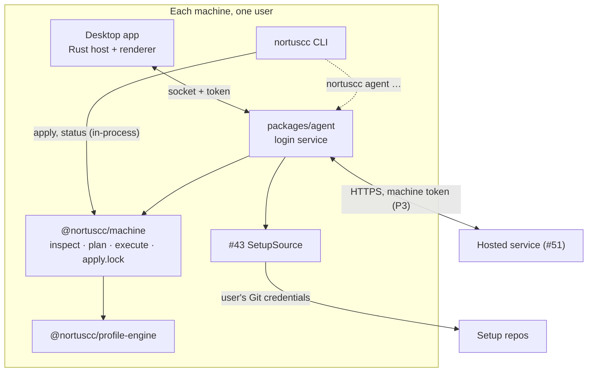

# Local agent: a background service that keeps each machine on its policy

Issue #50, phase P2 of the UI and feature map
(`docs/superpowers/specs/2026-10-05-desktop-ui-feature-map-design.md`). It runs on
`@nortuscc/machine` (#42, `docs/superpowers/specs/2026-10-05-machine-rebuild-design.md`) and
pairs with machine sync (#43). The hosted service (#51,
`docs/superpowers/specs/2026-10-05-hosted-service-design.md`) depends on it, and the agent is
that service's only client. Engine terms (layers, pins, provenance) are the profile engine's
(`docs/superpowers/specs/2026-10-05-profile-engine-design.md`).

## Intent and scope

A process on every machine that keeps the machine on its policy while the app window is closed.
It inspects the machine on a schedule and reports drift. It applies accepted items according to
the machine's apply policy (*auto-apply*, *notify* or *manual*). It backs up before every apply
and records the apply in History. The desktop app becomes its client, and so does the CLI for
the agent's own commands.

**Done when**, with the window closed, an accepted item is applied on an auto-apply machine, a
hook item waits for a person on that machine, and both show up in History.

In scope:

- packaging and installation;
- how the agent relates to the CLI and to the app;
- the local IPC and how it is secured;
- scheduling;
- the policy engine and the code-running safety rule;
- notifications;
- History;
- upgrading the agent itself;
- failure and recovery;
- the agent's side of the hosted service.

Out of scope:

- implementing machine sync. #43 owns fetching, verifying and applied revisions, and this spec
  only names the interface the agent needs from it;
- the hosted service itself (#51);
- a tray or menu-bar icon;
- followed setups (P4).

Unchanged: the CLI works without the agent and without the hosted service, local-only mode
works without an account, and the renderer never chooses a path or a command (#39).

## Decisions

| Decision | Choice | Why |
| --- | --- | --- |
| Packaging | A per-user login service: a LaunchAgent on macOS, a `systemd --user` unit on Linux, a per-user logon Scheduled Task on Windows | It runs as the user, so it reaches the user's homes and keychain. It survives the app quitting and runs on headless machines. A system service would run as another user |
| Code and runtime | A new `packages/agent` replaces the app's Bun sidecar. The app ships it with its bundled Bun and registers it. App-less machines run it from the checkout on Node 24 | The agent is the backend moved out of the window. Protocol v2's requests (#58) carry over, so that work moves instead of being rewritten |
| CLI | Stays standalone and in-process, sharing `apply.lock`. It talks to the agent only for `nortuscc agent …` | The CLI must keep working on machines with no agent |
| IPC | A user-only Unix socket or named pipe, plus a per-start token file checked in `hello` | Same-user only, with a second check where pipe permissions are weak. No TCP port for browsers to reach |
| Scheduling | Timer plus events, without file watching | Agents rewrite `~/.claude` constantly. Watching would mostly report the agents' own writes |
| Safety rule | A fail-closed classifier: auto-apply only items it proves inert | Code can arrive through settings keys and copied config files, not only through integrations |
| Drift | Never auto-applied | A hand edit may be deliberate |
| Notifications | Posted by the app under its own identity. The agent draws no UI | A headless process has no notification identity on macOS or Windows |
| History | Append-only JSON Lines, shared by the agent and the CLI | Small, append-only data that works the same on Node and Bun with no native dependency |
| Upgrades | Whoever installed the agent upgrades it. The agent never downloads code | No network path runs code, which matches the safety model everywhere else |
| Recovery | A failed or interrupted auto-apply pauses auto-apply until a person resumes it | No retry loops, and a crash loop cannot keep changing the machine |

## Architecture



`packages/agent` is a library with one entry point, `runAgent(paths)`. It holds:

- **Scheduler**: triggers and the single job queue.
- **Job**: refresh, resolve, inspect, sort, classify and act (see Run loop).
- **Classifier**: the pure safety rule.
- **IpcServer**: the socket, the handshake and the request handlers.
- **Notifier**: delivery and deduplication.
- **HostedClient** (P3): sync, outbox and status reports.
- **Service units**: rendering and registering the login service for each OS.

`MachinePaths` comes from `pathsFromEnvironment`, exactly as the CLI and the app build it. The
agent reads no environment below that.

### The app

- The Bun sidecar goes away. The Rust host connects to the agent's socket instead of spawning a
  backend, so the window adds no process. #58's protocol v2 handlers (`inspect`,
  `preview { exclude }`, `apply { planId }`, `cancel` and the `STALE` re-plan check) move into
  the agent unchanged.
- The app bundles the agent: Bun plus the agent bundle, as resources. It registers the login
  service on first run (journey 1 in the feature map).
- Rust keeps its allow-list of request names. The renderer sends only opaque item keys taken
  from a report, and the agent checks them against that report.

### The CLI

- `apply`, `status`, `uninstall` and the rest stay in-process on `@nortuscc/machine`. They
  share `<stateRoot>/apply.lock` with the agent, so the two never change a machine at once.
- New commands reach the agent through the socket:

  | Command | Does |
  | --- | --- |
  | `nortuscc agent install [--linger]` | Registers the login service to run from this checkout. Refuses when the app has registered it |
  | `nortuscc agent uninstall` | Drains the agent and removes the service registration |
  | `nortuscc agent run` | Runs the agent in the foreground. The service unit calls this on app-less machines |
  | `nortuscc agent status` | Policy, paused state, pending, held and drift counts, last inspection, last sync |
  | `nortuscc agent review` | On a TTY only: preview pending and held items, confirm, apply. This is how a person approves held items on a headless machine |
  | `nortuscc agent resume` | Clears a pause after a failure |
  | `nortuscc agent policy <auto-apply\|notify\|manual>` | Sets this machine's policy |

- On any interactive command, the CLI asks a reachable agent for `status`. When items wait for
  a person, it prints one line to stderr: `2 items wait for you: run nortuscc agent review`.

### Contract with machine sync (#43)

The agent needs three operations, and #43 implements them as a `SetupSource` service:

- `fetch()` updates the setup's remote refs and never touches the user's working tree. The
  author's checkout is their working copy.
- `load(revision)` returns the `DesiredConfig` at that revision's commit, verified against the
  revision record. It fails with `RevisionMismatch` when the recomputed items differ, and with
  `RevisionUnavailable` when the commit cannot be fetched.
- `effective(decisions)` returns this machine's desired configuration: the applied revision,
  plus the accepted items from newer revisions. Skipped and undecided items stay at their
  applied value. Conflicts with overrides come back as a list and are never resolved silently.

#43 also owns recording which revision is applied and resolving conflicts. The agent only
surfaces conflicts in its status. Until #43 lands, the agent's tests fake `SetupSource`.

### Agent state

Everything lives under `<stateRoot>` (`~/.config/nortuscc` by default):

| Path | Holds |
| --- | --- |
| `agent/` (mode 0700) | Everything below except History and decisions |
| `agent/agent.sock`, `agent/agent.token` | The IPC endpoint and its token (see IPC) |
| `agent/agent.json` | `{ version: 1, policy, paused, installedBy: 'app' \| 'cli', agentVersion }` |
| `agent/setups.json` | The setups this machine trusts. In P2 that is only the user's own repo, `MachinePaths.repo` |
| `agent/notified.json` | Hashes of item sets already notified |
| `agent/sync.json` (P3) | The last `seq`, the ETag and the time of the last successful sync |
| `agent/agent.log` | The service's stdout and stderr, rotated at 1 MiB, keeping 3 files |
| `decisions.json` | Accept and skip decisions with a `synced` flag. Unsynced entries are the outbox |
| `history/<YYYY-MM>.jsonl` | History (see History) |

Decisions sit beside `overrides.json`, outside `agent/`, because they are user intent like
overrides. A `DecisionsStore` service reads and writes them with an atomic replace. While the
agent is reachable, every writer routes decisions through it. The CLI writes the file directly
only when no agent answers.

The set of trusted setups changes only through a person on this machine. A setup that appears
through sync is offered as a prompt and is never trusted automatically.

## Run loop

### Triggers

Triggers that arrive while a job runs coalesce into one follow-up job. Jobs never overlap.

- the agent starting;
- the inspection timer: every 60 minutes, ±10% jitter;
- waking from sleep, detected as a wall-clock jump of more than twice the timer period between
  ticks;
- a sync that returned new decisions, revisions or machine settings;
- a #43 `fetch()` that moved the setup. Local-only mode fetches every 60 minutes, ±10% jitter;
- `overrides.json` or `decisions.json` changed (checked by mtime when each job starts);
- a client's `inspect`, `syncNow` or `decide`.

### A job

1. **Refresh.** When signed in (P3), call `GET /v1/sync` and drain the outbox (see Hosted
   service). A revision that fails `load` is recorded as `revision-rejected` and notified. Only
   that revision is blocked.
2. **Resolve.** Ask `SetupSource.effective(decisions)` for the `DesiredConfig`. If the profile or
   `overrides.json` is invalid (`ProfileInvalid`), the job continues as inspect-only and the
   status names the problem.
3. **Inspect.** `inspect(desired, domains)` produces the `MachineReport`.
4. **Sort.** Every item whose disposition is `apply` or `capture` is one of two kinds:
   - **pending**: its desired value differs between the applied revision's configuration and the
     effective configuration. A person accepted the change;
   - **drift**: the machine differs from a desired value that did not change.

   Drift is reported and never auto-applied.
5. **Classify.** Each pending item is either `inert` or `held(reason)` (see Classifier).
6. **Act** by the machine's policy:

   | Policy | Pending inert items | Held items | Drift |
   | --- | --- | --- | --- |
   | auto-apply | Applied in the background | Recorded as `held`, notified once | Reported |
   | notify | Recorded as `ready`, notified once | Recorded as `held`, notified once | Reported |
   | manual | Shown in status only | Shown in status only | Reported |

7. **Publish.** Push the new status to subscribed clients, and in P3 report it to the service.

### Auto-apply

An auto-apply run:

1. plans with `plan('apply', report, { ...selectAll, only: inertKeys }, domains)`;
2. refuses the run if any step's `action` is not `write-file`, `merge-keys` or
   `install-skills`. This guards against a classifier bug, and a refusal pauses auto-apply like
   a failure;
3. writes `apply-started` to History;
4. runs `execute(plan, report, domains, { signal })` with a fresh `backupsForRun()`;
5. writes `apply-finished` with each step's result and the backup folder.

A held `apply.lock` (the CLI is applying) skips the run until the next trigger. It is not a
failure and pauses nothing.

### A person applying

The app's Review & apply and `nortuscc agent review` use `preview { exclude }` and
`apply { planId }`, which can include held items and drift fixes. `apply` re-inspects and
re-plans, and refuses with `STALE` and a new preview when the plan changed, as in #58.

These are person-initiated applies, and they run even while auto-apply is paused. A person is
an `apply` sent by the app on a click, or by the CLI from a TTY after a confirmation. Any
process running as the same user could forge that request, but such a process can already
write `~/.claude` directly, so the agent exposes no new power.

## Classifier

The classifier is a pure function of an item's entry in two `DesiredConfig` values: the applied
revision's and the effective one, both computed by the engine from the fetched commit. It never
reads the hosted service's `change` field or any other service data. It fails closed: anything
it does not recognise is held.

| Item | Inert when | Held otherwise |
| --- | --- | --- |
| Instruction file: a `copy`-mode file whose `dest` ends in `.md` | Added or changed | Removed, or no longer managed |
| Settings key in a `merge-keys` file | Added or changed, and the key is in `INERT_KEYS[file.id]` | Any key not in the table, and any removal |
| Any other copied file, such as `codex-openrouter`'s `config.toml` | Never | Always. It can declare MCP servers or commands |
| Skill | Added or changed **with a pin**, so its content is fixed by the verified commit | Unpinned, or removed (including `install: false`) |
| Integration: hook, MCP server, plugin or marketplace | Never | Always |
| Anything else | Never | Always |

A held item's reason names its row, for example `held: integration` or
`held: settings key not known to be inert`.

`INERT_KEYS` is a closed, reviewed table in `packages/agent`, keyed by file id. Classification
is by top-level key, so a nested object is inert only when its whole key is listed. It starts
as:

```ts
const INERT_KEYS = {
  'claude:settings.json': ['attribution', 'effortLevel', 'model', 'outputStyle', 'theme', 'tui'],
};
```

- `worktree` stays held until someone reviews what it can do.
- Keys that run or steer code are never added: `hooks`, `statusLine`, `apiKeyHelper`, `env`,
  `permissions`, `enabledPlugins` and similar.
- Adding a key is a code change with its own review and a test row.

Item ids map one to one between `Observed.key` and the hosted service's item ids:

| `Observed.key` | Hosted id |
| --- | --- |
| `config:claude:settings.json#effortLevel` | `setting:claude:settings.json#effortLevel` |
| `config:claude:CLAUDE.md` | `file:claude:CLAUDE.md` |
| `skill:<name>` | `skill:<source>/<name>` |
| `integration:<id>` | `integration:<id>` |

The mapping is one pure function in the agent. It moves into `hosted-protocol` when #51
creates that package.

## Policy

- The policy is per machine. The default is `notify`, as in the feature map's first-run
  journey.
- In local-only mode it lives in `agent.json`. When signed in, the service's `machine.policy`
  is the synced copy. A local change is written to `agent.json` and sent through
  `PATCH /v1/machines/:id` for its own id, queued when the service is offline.
- A policy set from another of the user's machines arrives through sync. It can switch a
  machine to auto-apply, but the classifier still holds code-running items for a person on the
  machine itself.
- Every policy change is a `policy-changed` History event, recording whether it was local or
  synced.

## IPC

### Endpoint

- **macOS and Linux:** a Unix socket at `<stateRoot>/agent/agent.sock`. The directory is mode
  0700 and the socket is mode 0600.
- **Windows:** the named pipe `\\.\pipe\nortuscc-agent-<user SID>`, created with an explicit
  DACL that grants only the current user. Node's default pipe DACL grants read access to
  Everyone, so the agent never relies on it.
- **Token:** on every start, the agent writes 32 random bytes, base64url-encoded, to
  `<stateRoot>/agent/agent.token`. The file is mode 0600, or carries a user-only ACL on
  Windows. Clients read it fresh on each connection.
- **Single instance:** a second agent that finds a live socket exits 0. A stale socket (nothing
  answers `hello`) is removed and recreated.

### Framing

JSON lines with request ids. Each record is at most 1 MiB and carries `version: 1`. Records
decode strictly against Effect Schemas in `packages/agent`, and an unknown field is rejected.
Errors are `{ code, message }`. Progress, status and notification events are separate records
from responses, as in protocol v2.

The first record on a connection must be:

```json
{ "version": 1, "id": "1", "request": "hello", "token": "…", "client": "app", "protocol": 1 }
```

The agent compares the token in constant time and closes the connection on a mismatch. The
reply is `{ agentVersion, protocol, policy, paused }`.

### Requests

| Request | Result |
| --- | --- |
| `status` | Policy, paused state, pending, held, ready, drift, conflicts, last inspection, last sync |
| `inspect` | Runs a job now. Returns the `MachineReport` with each item's pending, drift or held classification |
| `preview { exclude: key[] }` | `{ planId, plan }` |
| `apply { planId }` | Progress events, then a final result, or `STALE` with a new preview |
| `cancel` | Cancels the running apply through its `signal` |
| `decide { items: [{ id, revision, decision }] }` | Records accept or skip decisions and queues them for sync |
| `setPolicy { policy }` | Changes this machine's policy |
| `resume` | Clears a pause |
| `history { before?, limit }` | History events, newest first, at most 500 |
| `restore { backupId }` | Restores a backup that History lists |
| `syncNow` | Triggers a sync (P3). The app sends it whenever it gains focus |
| `subscribe` | Pushes status, progress and notification events until the connection closes |
| `trustSetup { setupId }` | Trusts a setup that sync offered (used from P4) |
| `signIn`, `signOut` (P3) | Runs the hosted device flow and returns the user code to show |
| `drain` | Finishes the current step, releases the lock and exits 0 |

No request takes a path, a command or a URL. Item keys are checked against the latest report,
and a `backupId` must be a folder that History lists.

## Notifications

The agent draws no UI. It notifies when:

- items wait for a person: `held` on any policy, and `ready` on notify;
- an apply fails, or auto-apply pauses;
- a revision fails verification.

A successful auto-apply is recorded in History only. A manual machine is notified only of
failures.

One notification covers each new batch. The Notifier hashes the sorted item ids of a batch and
records the hash in `notified.json`, so the same items never notify twice. Delivery tries these
in order:

1. **A connected app** with a `subscribe` stream. The app posts the OS notification under its
   own identity, and clicking it opens Review & apply.
2. **The installed app, launched hidden** in a notify-only mode that posts and exits:
   `open -g -a <app> --args --notify <id>` on macOS, and the app's executable with `--notify`
   elsewhere. The agent finds the app only through the path it recorded when the app registered
   the service.
3. **`notify-send`** on Linux, when it is on PATH.

Without any of these, the CLI's one-line reminder and `nortuscc agent status` remain.

## History

History is append-only JSON Lines in `<stateRoot>/history/<YYYY-MM>.jsonl`. A `HistoryStore`
service is shared by the agent and the CLI, so CLI applies appear too. It belongs in
`@nortuscc/machine`, and is added after #55–#58 land so it does not collide with them.

Every event is `{ "v": 1, "at": "<ISO time>", "kind": "…", "actor": "agent" | "cli" | "app", … }`:

| Kind | Carries |
| --- | --- |
| `apply-started` | Run id, whether it was automatic, plan keys |
| `apply-finished` | Run id, each step's outcome and note, backup folder, `done` or `cancelled` |
| `held`, `ready` | Item ids with their reasons |
| `decided` | Item id, revision, accept or skip |
| `policy-changed` | Old and new policy, local or synced |
| `paused`, `resumed` | Reason |
| `restore` | Backup folder, outcome |
| `revision-verified`, `revision-rejected` | Setup, revision, error code |
| `sync-failed` | Error code, at most one per hour |
| `backups-pruned` | Folders removed |

- Each event is a single append of one line. A reader skips a torn last line.
- Apply events are written while `apply.lock` is held.
- History is kept indefinitely. It grows by kilobytes a month.
- Restore is driven from History: the app lists `apply-finished` events with backup folders and
  sends `restore { backupId }`.

Backups stay in `MachinePaths.backups`, in today's layout. After each apply, the agent prunes
backup folders that are both older than 90 days and outside the newest 20, and records a
`backups-pruned` event. A folder is never pruned while it is the latest backup History
references.

## Install and upgrade

### Service units

| OS | Unit | Behaviour |
| --- | --- | --- |
| macOS | `~/Library/LaunchAgents/com.nortuscc.agent.plist` | `RunAtLoad`, `KeepAlive { SuccessfulExit: false }`, `ProcessType Background`, output to `agent.log`. Managed with `launchctl bootstrap gui/<uid>`, `kickstart` and `bootout` |
| Linux | `~/.config/systemd/user/nortuscc-agent.service` | `Restart=on-failure`, `RestartSec=10`. `--linger` runs `loginctl enable-linger` so the agent runs on a headless machine with nobody logged in. It is opt-in |
| Windows | A per-user Scheduled Task, `nortuscc-agent` | Starts at the user's logon, restarts on failure up to 3 times a minute, no time limit |

The unit names its program by absolute path and runs it with argv only, never through a shell:

- installed by the app: the bundled Bun and the agent bundle inside the app;
- installed by the CLI: the absolute `node` path and `<checkout>/bin/nortuscc.mjs agent run`.

Rendering a unit is a pure function from those paths to text. Registering it runs the OS tool
through `Processes`.

### Ownership

When the app is installed, it owns the service. It registers the service on first run and
re-registers it if its own location changed. `nortuscc agent install` refuses while
`installedBy` is `app`, and points to the app. It registers the service only on machines
without the app.

### Upgrade

The agent never downloads code.

1. An app update ships a new agent bundle. When the app starts, `hello` reports the running
   agent's version.
2. If it differs from the bundled one, the app sends `drain`, rewrites the unit if a path
   changed, and restarts the service through the OS tool.
3. On app-less machines, `nortuscc pull` does the same for the checkout-run agent.

A client that does not speak the agent's `protocol` does not guess. The app offers to reinstall
its bundled agent, and the CLI prints the command that does it.

### Uninstall

`nortuscc agent uninstall` drains the agent, unregisters the unit, and removes `agent.sock` and
`agent.token`. It keeps History, decisions and backups. The CLI's `uninstall` of configuration
does not remove the agent.

## Failure and recovery

`@nortuscc/machine` already guarantees that:

- a backup precedes every write;
- each file step is atomic and persists its baseline before the next step;
- an interrupted installer step is cancelled;
- a lock whose owner died is taken over.

The agent adds these rules:

- **Pause on failure.** A failed step in an auto-apply, a refused plan, or an auto-apply that
  History shows started and never finished (the agent crashed) sets `paused` in `agent.json`.
  The agent records `paused` with the reason and notifies.
  - While paused, auto-apply stops. Inspection, sync, the outbox and person-initiated applies
    continue.
  - Only `resume`, from the app or `nortuscc agent resume`, clears the pause. Restore is offered
    beside it.
  - There are no automatic retries.
- **Crash restarts.** The service manager restarts a crashed agent with its own throttling.
  Because an interrupted apply pauses auto-apply, a crash loop cannot keep changing the
  machine.
- **These failures do not pause:**
  - a held `apply.lock` waits for the next trigger;
  - `ProfileInvalid` blocks applies until the profile is fixed;
  - a rejected revision blocks only that revision;
  - an unreachable hosted service only ages the synced data.
- **Agent unreachable.** The app shows its offline state with the last known data and its age,
  and offers *Restart agent*, which kicks the unit through the OS tool. The CLI's own commands
  are unaffected.

## Hosted service (P3)

This section is the agent's side of #51, which treats these points as decided.

- **Machine token.** The token is stored in the OS keychain: macOS Keychain, libsecret
  (`secret-tool`) or Windows Credential Manager. The platform tool always receives the secret on
  stdin, never in argv. Without a keychain, the agent falls back to
  `<stateRoot>/agent/machine-token`, mode 0600. Only the agent reads the token. The app and the
  renderer never see it.
- **Sign-in.** `signIn` runs `POST /v1/auth/device/start` and `/poll`. The app or CLI shows the
  user code. The default machine name is `<OS> machine`, and the hostname is never sent unless
  the user types it.
- **Polling.** The agent calls `GET /v1/sync?since=<seq>` with `If-None-Match` every `pollAfter`
  seconds, ±20% jitter. It also polls immediately after a local decision and on `syncNow`, which
  the app sends when it gains focus. `rate_limited` and `unavailable` honour `Retry-After`.
- **Outbox.** Unsynced entries in `decisions.json` are sent in `decidedAt` order with
  `PUT /v1/decisions`, then marked synced. On `stale_decision`, the agent re-syncs and keeps the
  newer decision. The service is never on the apply path: offline, the agent keeps applying
  already-decided items under its policy.
- **Trust.** Setups from sync that are not in `setups.json` are offered, never trusted. Revisions
  are applied only after `SetupSource.load` verifies them against Git. The classifier reads only
  the fetched commit.
- **Status.** When `reportStatus` is on, the agent sends `PUT /v1/machines/self/status` after
  each job whose status changed: revision applied, adopted, skipped, pending and
  waiting-for-person item ids, and drift as counts only. It never sends paths, values or file
  contents.
- **Sign-out** revokes the token, deletes it locally and returns the machine to local-only mode
  with its local data intact.

## Testing

Tests are written first, in `packages/agent/checks/*.spec.ts`, using `node:test` and
`node:assert/strict` against temporary directories, fake executables and a fake `SetupSource`.

- **Classifier:** table-driven, one case per row in both directions, every `INERT_KEYS` entry,
  a nested object under an unlisted key, and the fail-closed default for an unknown kind.
- **Sorting:** pending versus drift for a changed desired value, an unchanged one, and a skipped
  item.
- **Policy matrix:** each policy against inert, held and drift items, checking History events
  and notifications.
- **Scheduler:** trigger coalescing, wake detection with an injected clock, and no overlapping
  jobs.
- **Lock:** a fake CLI holds `apply.lock`, and the agent waits without pausing.
- **Pause:** a failed step, a refused plan, and a simulated crash between `apply-started` and
  `apply-finished` all pause; `resume` clears it; person-initiated applies run while paused.
- **IPC:** a wrong token, a missing `hello`, unknown fields, an oversized record, a path where a
  key belongs, an unknown `backupId`, `STALE`, and `drain` releasing the lock.
- **History:** a torn last line, month rollover, and pruning that keeps the latest referenced
  backup.
- **Notifier:** deduplication across restarts, and the delivery order with fakes for each path.
- **Unit files:** rendered text for each OS, compared with committed snapshots.
- **Done-when scenario:** the agent runs in-process with a temporary HOME and a fixture setup
  repo. A revision adds an inert settings key and a hook, and both are accepted. On an
  auto-apply machine, the key is applied with a backup and the hook is held. History contains
  `apply-finished` with that backup and a `held` event for the hook.
- **macOS smoke:** opt-in, outside `npm test`. It registers the LaunchAgent under a temporary
  label, checks `hello` over the socket, and unregisters it.

Done when these tests and the typecheck pass, the done-when scenario passes, and the root
`npm test` and `npm run test:packages` still pass.

## Issues

#50 tracks the work. It splits into these sub-issues:

| # | Issue | Depends on |
| --- | --- | --- |
| 1 | **Agent core**: `packages/agent` with the scheduler, job, sorting, classifier and policy; `HistoryStore` and `DecisionsStore` in `@nortuscc/machine`; pause and resume; the in-process done-when test | #42's domains (#55–#57); #43's `SetupSource` interface, faked until it lands |
| 2 | **IPC and app cutover**: the socket or pipe server, token and protocol; the Rust host on the socket; the Bun sidecar removed; the CLI's `agent status`, `review`, `resume` and `policy` | 1, #58 |
| 3 | **Install and upgrade**: units for the three OSes, `agent install`, `uninstall` and `run`, app registration and ownership, drain and restart on upgrade, the macOS smoke | 1 |
| 4 | **Notifications**: the Notifier, the app's notify-only mode, `notify-send`, the CLI reminder | 2 |
| 5 | **Hosted client** (P3, with #51): keychain token, sign-in, sync, outbox, status reports | 1, 2, #51's `hosted-protocol` |

## Later

- A tray or menu-bar icon in the app, on top of the same IPC.
- Followed setups (P4) extend `setups.json` and `trustSetup`.
- Widening `INERT_KEYS` as more owned keys are reviewed.
